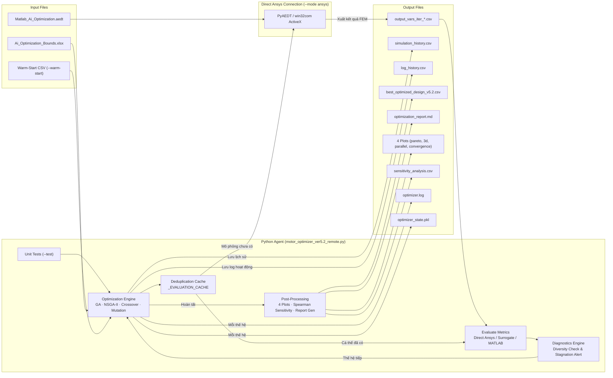

# AI Optimization of V-Shape IPM Motor – Agent Instructions

> Tài liệu đầy đủ và chuyên nghiệp cho dự án tối ưu hóa thiết kế motor IPM hình chữ V thông qua trí tuệ nhân tạo  
> **Cập nhật lần cuối**: 2026-07-23

---

## 1. Tổng quan dự án (Project Overview)

Dự án này xây dựng một hệ thống tối ưu hóa tự động cho **motor IPM (Interior Permanent Magnet)** hình chữ V, sử dụng thuật toán di truyền (GA) hoặc NSGA-II trong môi trường AI Agent kết nối trực tiếp với phần mềm mô phỏng điện từ Ansys Maxwell.

### Công nghệ chính:
| Thành phần | Vai trò | Ngôn ngữ / Công nghệ |
|------------|--------|------------------------|
| **Python (AI Agent)** | Tạo các bộ tham số thiết kế, quản lý quần thể, đánh giá hiệu suất, thực hiện tối ưu đa tiêu chí, quản lý cache... | Python 3.13 |
| **Ansys Maxwell (FEM Simulation)** | Tính toán hiệu suất thực tế: mô-men xoắn, tổn thất, chi phí vật liệu... | Ansys Electronics Desktop 3D |
| **Cổng kết nối mô phỏng** | Cung cấp ba phương thức mô phỏng: Direct Ansys, MATLAB Bridge, và Offline Surrogate | PyAEDT / win32com / MATLAB / Sklearn |

### Ý tưởng cốt lõi:
- Python AI Agent tạo tập hợp các thiết kế hợp lệ (19 biến).
- Truyền tham số trực tiếp vào Ansys Maxwell (hoặc qua MATLAB hoặc mô hình máy học).
- Nhận kết quả mô phỏng FEM → Phân tích điểm số, xếp hạng Pareto.
- Lặp lại quá trình cho đến khi đạt được thiết kế tối ưu cuối cùng.

---

## 2. Cấu trúc thư mục (Directory Structure)

```
Ai_Optimization_Of_Vshape_IPM_motor/
│
├── Ai_Optimization_Bounds.xlsx         ← Dữ liệu giới hạn 19 biến thiết kế
├── Ai_Optimization_ParamValues.xlsx    ← File CSV truyền biến cho MATLAB
├── Matlab_Ai_Optimization.aedt         ← Dự án Maxwell 3D mẫu
├── Optimization Requirements.pdf       ← Tài liệu yêu cầu công nghệ gốc
├── Optimization_Requirements_ver2.md   ← Bản Markdown yêu cầu tối ưu hóa
├── Qwen_Improvement_Suggestions.md     ← Gợi ý cải tiến từ AI
│
├── best_optimized_design_v5.2.csv      ← Thiết kế tốt nhất đã đạt được
├── output_vars_iter_*.csv              ← Kết quả mô phỏng từng cá thể
├── optimizer.log                       ← Nhật ký chi tiết từng thế hệ
├── log_history.csv                     ← Lịch sử hoạt động từng cá thể qua từng thế hệ
├── optimizer_state.pkl                 ← trạng thái checkpoint để tiếp tục sau khi bị gián đoạn
├── optimization_report.md              ← Báo cáo định dạng Markdown tự động
├── pareto_front.png                    ← Đồ thị Pareto hiệu suất vs nhấp nhô mô-men
├── pareto_3d.png                       ← Đồ thị 3D Pareto (Hiệu suất – Nhấp nhô – Chi phí)
├── parallel_coordinates.png            ← Biểu đồ tọa độ song song cho 4 mục tiêu
├── convergence_history.png             ← Biểu đồ lịch sử hội tụ qua từng thế hệ
├── sensitivity_analysis.csv            ← Bảng phân tích độ nhạy Spearman của biến thiết kế
├── simulation_history.csv              ← Lịch sử toàn bộ lần chạy mô phỏng
│
├── motor_optimizer_ver5.2_remote.py     ← Script chính của phiên bản v5.2 (đã tích hợp Direct Ansys)
├── motor_optimizer_ver5.1_remote.py     ← Script v5.1 gốc (Production-grade)
├── Python_code/                         ← Thư mục chứa các phiên bản cũ (v1 -> v5.1)
│   ├── motor_optimizer_ver5.1.py
│   ├── motor_optimizer_ver5.py
│   └── requirements.txt                ← Yêu cầu thư viện Python
│
├── .venv/                               ← Môi trường ảo Python (đã cài đặt pywin32, pyaedt, pandas, numpy...)
├── Ai_optimization.m                    ← Script MATLAB điều khiển Ansys Maxwell (cầu nối cũ)
├── AGENTS.md                            ← Tài liệu hướng dẫn bạn đang đọc
├── README.md                            ← Mô tả tổng quan & cách chạy ngắn gọn
├── Technical_Reference.md               ← Tài liệu tham chiếu kỹ thuật chuyên sâu
└── workflow_optimization.md             ← Sơ đồ luồng hoạt động (Mermaid)
```

---

## 3. Các biến thiết kế (19 Design Variables)

Dưới đây là danh sách các biến thiết kế được tối ưu hóa:

| # | Tên biến         | Mô tả                                              | Giá trị ban đầu | Giới hạn dưới | Giới hạn trên | Bước nhảy | Đơn vị |
|---|------------------|----------------------------------------------------|----------------|--------------|--------------|-----------|--------|
| 1 | `Dr_in`          | Đường kính trong rotor                            | 90             | 50           | 90           | 5         | mm     |
| 2 | `Air_gap`        | Khe hở không khí giữa rotor và stator            | 1.0            | 0.5          | 1.5          | 0.1       | mm     |
| 3 | `Lamda`          | Tỷ lệ chiều dài stack / đường kính khe hở         | 0.9            | 0.8          | 1.0          | 0.1       | –      |
| 4 | `Bridge`         | Khoảng cách từ rotor ngoài tới lỗ nam châm         | 1.5            | 1.0          | 3.0          | 0.1       | mm     |
| 5 | `Hs0`            | Chiều cao rãnh răng stator                        | 1.19           | 1.0          | 2.0          | 0.1       | mm     |
| 6 | `Hs1`            | Độ nghiêng rãnh                                    | 1.5            | 1.0          | 2.0          | 0.1       | mm     |
| 7 | `Hs2`            | Chiều cao rãnh chính                              | 18.08          | 16           | *Constraint* | 1         | mm     |
| 8 | `Bs0`            | Bề rộng miệng rãnh                                 | 2.11           | 1.5          | 4.0          | 0.5       | mm     |
| 9 | `Bs1`            | Bề rộng rãnh phía dưới                            | 6.90           | 3.0          | 10.0         | 0.5       | mm     |
| 10 | `Bs2`           | Bề rộng rãnh phía trên                            | 10.88          | 5.0          | 14.0         | 1.0       | mm     |
| 11 | `O1`            | Khoảng cách đáy ống dẫn                           | 5.4            | 0            | 13           | 1         | mm     |
| 12 | `O2`            | Khoảng cách ống dẫn từ rotor trong                | 6.0            | 2.0          | 7.0          | 0.5       | mm     |
| 13 | `B1`            | Bề dày ống dẫn                                   | 3.5            | 3.2          | *Constraint* | 0.5       | mm     |
| 14 | `rib`           | Bề rộng xương sườn                                | 2.0            | 2.0          | 15.0         | 1.0       | mm     |
| 15 | `hrib`          | Chiều cao xương sườn                              | 2.4            | 2.0          | 6.0          | 0.5       | mm     |
| 16 | `Mt`            | Bề dày nam châm                                   | 5.282          | 4.0          | 6.0          | 0.2       | mm     |
| 17 | `Mw`            | Bề rộng nam châm                                   | 25.44          | 10.0         | 30.0         | 2.0       | mm     |
| 18 | `magDmin`       | Khoảng cách tối thiểu giữa các nam châm          | 10.0           | 0.0          | 10.0         | 1.0       | mm     |
| 19 | `thet_deg`      | Góc pha dòng kích thích                           | 30             | 0            | 90           | 1         | deg    |

### Các hằng số cố định:
| Tên | Giá trị | Mô tả |
|-----|----------|-------|
| `Ds_out` | 240 mm | Đường kính ngoài stator |
| `L_stk` | 134 mm | Chiều dài stack |
| `SLOT_HEIGHT_MARGIN` | 12.25 mm | Biên an toàn cho rãnh stator |
| `SlotNum` | 36 | Số rãnh stator |
| `PolesNum` | 6 | Số cực rotor |
| `Imax` | 200 A | Dòng điện cực đại |
| `J` | 5.5 A/mm² | Mật độ dòng điện |
| `f0` | 50 Hz | Tần số dòng điện |

---

## 4. Ràng buộc hình học (Geometric Constraints)

Các ràng buộc hình học đảm bảo thiết kế có thể sản xuất được thực tế. Hệ thống kiểm tra 4 ràng buộc sau:

### Ràng buộc 1: Giới hạn chiều cao rãnh

$$
Hs_0 + Hs_1 + Hs_2 < \frac{Ds_{out} - Ds_{in}}{2} - 12.25
$$

$$
Ds_{in} = \frac{L_{stk}}{Lamda} + Air\_gap
$$

> Nếu vi phạm, rãnh sẽ vượt ra khỏi thân stator → sửa lỗi trực tiếp bằng thuật toán **Snap-to-Step** hoặc **Smart Repair**.

### Ràng buộc 2: Giới hạn bề dày ống dẫn (Bridge Thickness)

$$
B_1 \le Mt - 0.3
$$

> Nếu vi phạm → điều chỉnh biến **B1** gần nhất theo **Smart Repair Logic**

### Ràng buộc 3: Rotor nằm hoàn toàn trong Stator

$$
Dr_{out} > Dr_{in} \quad \text{trong đó} \quad Dr_{out} = Ds_{in} - 2 \cdot Air\_gap
$$

### Ràng buộc 4: Khả thi hình học nam châm V-shape

$$
Mw > 2 \cdot B_1
$$

### Chiến lược sửa chữa thông minh (Smart Repair Function)

- **Chiến lược 1 (Snap-to-step)**: Chuyển giá trị về giá trị hợp lệ gần nhất.
- **Chiến lược 2 (Smart Repair)**: Tự xác định biến gây vi phạm và điều chỉnh thích hợp.
- Nếu sửa không thành công → giữ nguyên cá thể gốc → bị loại trong bước lọc chọn lọc.

---

## 5. Hàm mục tiêu (Objective Function)

Hàm điểm số tổng hợp dựa trên nhiều tiêu chí trọng số (Weighted Composite Score):

$$
\text{Score} = 
w_{eff} \cdot \text{Efficiency}(\%) 
- w_{ripple} \cdot \text{Torque Ripple}(\%) 
+ w_{pwr} \cdot \text{PowerDensity}(\text{kW/kg}) 
- w_{cost} \cdot \frac{\text{Cost}}{150.0}
$$

- **Efficiency ($w_{eff}$)**: Tối đa hóa hiệu suất (%) → mặc định 1.0
- **Torque Ripple ($w_{ripple}$)**: Tối thiểu hóa nhấp nhô mô-men xoắn (%) → mặc định 1.0
- **PowerDensity ($w_{pwr}$)**: Thưởng nếu có mật độ công suất cao (kW/kg) → mặc định 0.5
- **Cost ($w_{cost}$)**: Phạt nhẹ nếu chi phí vật liệu cao → mặc định 0.05

> Trọng số có thể điều chỉnh qua CLI với flag `--w-eff`, `--w-ripple`, `--w-pwr`, `--w-cost`.

---

## 6. Luồng hoạt động (Detailed Workflow)

### Bước 1: Kiểm tra môi trường & Unit Tests

```powershell
.\.venv\Scripts\python.exe motor_optimizer_ver5.2_remote.py --test
```

> Chạy 14 bài kiểm thử tích hợp: ràng buộc hình học, NSGA-II, crowding distance, repair function, warm-start, caching, và tích hợp Ansys.

---

### Bước 2: Khởi tạo quần thể

- Đọc `Ai_Optimization_Bounds.xlsx`.
- Nếu có `--warm-start <path>`: nạp thiết kế từ file CSV, xử lý lỗi, bổ sung nếu thiếu.
- Nếu không có warm-start: sinh ngẫu nhiên cá thể hợp lệ thỏa ràng buộc.

---

### Bước 3: Đánh giá hiệu suất (Fitness Evaluation)
Hệ thống kiểm tra `_EVALUATION_CACHE` trước khi mô phỏng:

#### 3 cách mô phỏng:
| Chế độ | Mô tả | Công cụ sử dụng |
|-------|--------|------------------|
| `--mode ansys` | Mô phỏng trực tiếp qua `PyAEDT` hoặc `win32com` ActiveX (recommended) | PyAEDT, win32com |
| `--mode matlab` | Truyền tham số qua Excel → gọi MATLAB → gọi Ansys ActiveX | MATLAB Batch |
| `--mode offline` | Dùng mô hình hybrid (KNN + GP) dự đoán kết quả nhanh | Sklearn (KNN, GP, IDW) |

> Nếu đã chạy trước đó, kết quả được load từ cache trực tiếp **không cần chạy lại FEM**.

---

### Bước 4: Chọn lọc & Diagnostics

- **`--algorithm ga`**:
  - Chọn lọc theo Tournament Selection và bảo tồn cá thể tốt nhất (Elitism).
- **`--algorithm nsga2`**:
  - Full NSGA-II (Fast Non-Dominated Sorting + Crowding Distance Assignment).

> **Diagnostics tự động**: Đo độ đa dạng quần thể và phát hiện hiện tượng kẹt cực trị.

---

### Bước 5: Lai ghép & Đột biến

- **Lai ghép (Crossover)**: Uniform crossover với tỷ lệ `--crossover 0.7`
- **Đột biến (Mutation)**: Step offset mutation với tỷ lệ `--mutation 0.2`
- **Repair Function**: Sửa lỗi hình học khi vi phạm → tự động tái cấu trúc cá thể.

---

### Bước 6: Ghi log & Early Stopping

- Lưu lịch sử mô phỏng vào `simulation_history.csv`.
- Lưu lịch sử log vào `log_history.csv`.
- Nếu không cải thiện tối thiểu `--min-delta` trong `--patience` thế hệ → **Early Stop**.

---

### Bước 7: Xuất kết quả & Báo cáo

- Lưu thiết kế tốt nhất vào `best_optimized_design_v5.2.csv`.
- Tự động tạo `optimization_report.md`.
- Tự sinh 4 đồ thị trực quan:
  - `pareto_front.png`
  - `pareto_3d.png`
  - `parallel_coordinates.png`
  - `convergence_history.png`
- Phân tích độ nhạy Spearman → `sensitivity_analysis.csv`.

---

## 7. Cách chạy CLI (Command Line Interface)

### 1. Kiểm thử unit test:
```powershell
.\.venv\Scripts\python.exe motor_optimizer_ver5.2_remote.py --test
```

### 2. Chạy trực tiếp Ansys Maxwell (khuyến nghị):
```powershell
.\.venv\Scripts\python.exe motor_optimizer_ver5.2_remote.py --mode ansys --algorithm nsga2 --pop-size 8 --generations 10 --plot-all
```

### 3. Chạy offline siêu nhanh:
```powershell
.\.venv\Scripts\python.exe motor_optimizer_ver5.2_remote.py --mode offline --algorithm nsga2 --pop-size 12 --generations 30 --plot-all
```

### 4. Seed từ file CSV:
```powershell
.\.venv\Scripts\python.exe motor_optimizer_ver5.2_remote.py --mode ansys --warm-start best_optimized_design_v5.2.csv --generations 20
```

### 5. Tiếp tục từ checkpoint:
```powershell
.\.venv\Scripts\python.exe motor_optimizer_ver5.2_remote.py --resume --mode ansys --generations 50
```

### Các tùy chọn CLI đầy đủ:

| Flag | Mặc định | Mô tả |
|------|----------|------|
| `--algorithm` | ga       | Thuật toán: `ga`, `nsga2` |
| `--pop-size` | 8        | Kích thước quần thể |
| `--generations` | 10     | Số thế hệ tối đa |
| `--crossover` | 0.7      | Xác suất lai ghép |
| `--mutation` | 0.2     | Xác suất đột biến |
| `--mode` | offline | `ansys`, `offline`, `matlab` |
| `--non-graphical` | True | Chạy Ansys không giao diện |
| `--ansys-version` | 2023.2 | Phiên bản Ansys |
| `--matlab-exe` | matlab  | Đường dẫn MATLAB |
| `--warm-start` | None     | Dữ liệu khởi tạo từ CSV |
| `--seed` | None         | Dẫn đến tái lập kết quả |
| `--resume` | False     | Tiếp tục từ điểm checkpoint |
| `--w-eff` | 1.0       | Trọng số hiệu suất |
| `--w-ripple` | 1.0    | Trọng số độ nhấp nhô mô-men |
| `--w-pwr` | 0.5      | Trọng số mật độ công suất |
| `--w-cost` | 0.05    | Trọng số chi phí |
| `--patience` | 20     | Số thế hệ dừng sớm |
| `--min-delta` | 0.01 | Độ cải thiện tối thiểu |
| `--no-ml` | False    | Tắt mô hình ML |
| `--plot-pareto` | False | Xuất hình Pareto 2D |
| `--plot-all` | False    | Xuất 4 đồ thị |
| `--sensitivity` | False  | Tính độ nhạy Spearman |
| `--test` | False    | Chạy kiểm thử |
| `--no-report` | False | Bỏ tạo báo cáo Markdown |

---

## 8. Sơ đồ luồng dữ liệu (Data Flow Diagram)



---

## 9. Lịch sử phiên bản (Version History)

| Phiên bản | File | Thay đổi chính |
|-----------|------|----------------|
| v1 | `motor_optimizer.py` | GA cơ bản, không checkpoint |
| v2 | `motor_optimizer_ver2.py` | GA tiêu chuẩn, checkpoint, 4 ràng buộc, score đa tiêu chí, early stop |
| v3 / v4 | `motor_optimizer_ver3.py`, `ver4.py` | Tách phần mô hình ML & NSGA-II |
| v5 | `motor_optimizer_ver5.py` | Tích hợp KNN, GA/NSGA-II, 2D Pareto, phân tích độ nhạy |
| v5.1 | `motor_optimizer_ver5.1.py` | Production-grade dùng thư mục input/output |
| v5.1_remote | `motor_optimizer_ver5.1_remote.py` | Gốc, đường dẫn phẳng, hỗ trợ MATLAB Bridge |
| v5.2_remote | `motor_optimizer_ver5.2_remote.py` | **Phiên bản Production-grade chính**:<br>1. Direct Ansys: `--mode ansys` không dùng MATLAB<br>2. Chạy headless: `--non-graphical` tiết kiệm RAM/CPU<br>3. Caching đánh giá: giảm 33-55% FEM<br>4. Warm-start từ CSV<br>5. Tăng 7 tính năng sửa lỗi & logging<br>6. 14 Unit tests tích hợp |

---