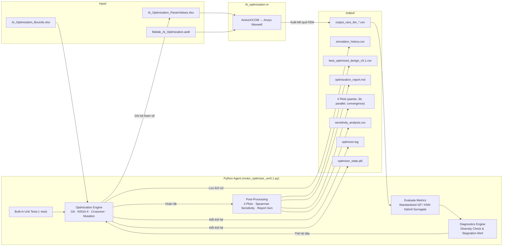

# AI Optimization of V-Shape IPM Motor – Agent Instructions

> Tài liệu hướng dẫn toàn diện cho dự án tối ưu hóa thiết kế motor IPM hình chữ V bằng trí tuệ nhân tạo.
> Cập nhật lần cuối: 2026-07-20

---

## 1. Tổng quan dự án (Project Overview)

Dự án này xây dựng một **hệ thống tối ưu hóa tự động** cho motor IPM (Interior Permanent Magnet) có nam châm dạng chữ V. Hệ thống kết hợp 3 công nghệ chính:

| Thành phần | Vai trò | Ngôn ngữ |
|---|---|---|
| **Python (AI Agent)** | Tạo ra các bộ tham số thiết kế motor bằng Thuật toán Di truyền (GA) hoặc NSGA-II, đánh giá kết quả, và lặp lại cho tới khi tìm được thiết kế tối ưu | Python 3.13 |
| **MATLAB (Cầu nối)** | Nhận bộ tham số từ Python, kết nối với Ansys Maxwell qua ActiveX/COM, chạy mô phỏng FEM, và xuất kết quả ra CSV | MATLAB |
| **Ansys Maxwell (Mô phỏng)** | Phần mềm mô phỏng điện từ (FEM) tính toán chính xác hiệu suất, mô-men xoắn, từ thông, v.v. cho mỗi thiết kế motor | GUI/COM |

**Ý tưởng cốt lõi:** Python tạo ra hàng trăm bộ tham số → MATLAB gửi từng bộ vào Ansys Maxwell → Kết quả mô phỏng được Python đọc lại để quyết định thế hệ tham số tiếp theo → Lặp lại cho đến khi hội tụ.

---

## 2. Cấu trúc thư mục (Directory Structure)

```
Ai_Optimization_Of_Vshape_IPM_motor/
│
├── input/                              ← Dữ liệu đầu vào (KHÔNG chỉnh sửa thủ công khi đang chạy)
│   ├── Ai_Optimization_Bounds.xlsx     ← Bảng 19 biến thiết kế: giới hạn trên/dưới, bước nhảy, đơn vị
│   ├── Ai_Optimization_ParamValues.xlsx← Bảng các bộ tham số để mô phỏng (Python ghi, MATLAB đọc)
│   ├── Matlab_Ai_Optimization.aedt     ← File dự án Ansys Maxwell chứa mô hình motor 3D
│   ├── Optimization Requirements.pdf   ← Tài liệu yêu cầu gốc (công thức, ràng buộc)
│   ├── Optimization_Requirements_ver2.md ← Bản Markdown của yêu cầu tối ưu hóa
│   └── Qwen_Improvement_Suggestions.md ← Gợi ý cải tiến từ AI
│
├── output/                             ← Kết quả đầu ra (được tạo tự động)
│   ├── best_optimized_design_v5.1.csv  ← Bộ tham số tốt nhất từ phiên bản v5.1
│   ├── best_optimized_design_v5.csv    ← Bộ tham số tốt nhất từ phiên bản v5
│   ├── best_optimized_design_v2.csv    ← Bộ tham số tốt nhất từ phiên bản v2
│   ├── output_vars_iter_*.csv          ← Kết quả mô phỏng FEM cho từng bộ tham số
│   ├── optimizer.log                   ← Nhật ký chi tiết từng thế hệ (generation)
│   ├── optimizer_state.pkl             ← File checkpoint để resume khi bị gián đoạn
│   ├── optimization_report.md          ← Báo cáo tổng hợp tự động dạng Markdown
│   ├── pareto_front.png                ← Đồ thị 2D Pareto (Efficiency vs Torque Ripple)
│   ├── pareto_3d.png                   ← Đồ thị 3D Pareto (Efficiency vs Torque Ripple vs Cost)
│   ├── parallel_coordinates.png        ← Biểu đồ tọa độ song song cho 4 mục tiêu
│   ├── convergence_history.png         ← Biểu đồ lịch sử hội tụ qua các thế hệ
│   ├── sensitivity_analysis.csv        ← Bảng phân tích độ nhạy Spearman của 19 biến
│   └── simulation_history.csv          ← Lịch sử toàn bộ các lần chạy mô phỏng
│
├── Python_code/                        ← Mã nguồn Python
│   ├── motor_optimizer_ver5.1.py       ← Script chính v5.1 (Production-grade: NSGA-II, GP ML, Unit tests, 4 Plots, Report)
│   ├── motor_optimizer_ver5.py         ← Script v5 (Bản tích hợp GA/NSGA-II)
│   ├── motor_optimizer_ver2.py         ← Script v2 (Bản GA tiêu chuẩn)
│   ├── motor_optimizer_ver3.py / ver4.py← Thử nghiệm mã khung ML / NSGA-II
│   ├── motor_optimizer.py              ← Script v1 (tham khảo)
│   └── requirements.txt               ← Danh sách thư viện Python cần cài đặt
│
├── .venv/                              ← Môi trường ảo Python (tạo bằng python -m venv)
├── Ai_optimization.m                   ← Script MATLAB chạy vòng lặp mô phỏng Ansys Maxwell
├── AGENTS.md                           ← File này – hướng dẫn toàn bộ dự án
├── README.md                           ← Tổng quan dự án và hướng dẫn chạy nhanh
├── Technical_Reference.md              ← Tài liệu tham chiếu kỹ thuật chuyên sâu
└── workflow_optimization.md            ← Sơ đồ luồng hoạt động (flowchart Mermaid)
```

---

## 3. Các biến thiết kế (19 Design Variables)

Đây là 19 tham số mà thuật toán tối ưu được phép thay đổi. Mỗi tham số kiểm soát một khía cạnh hình học khác nhau của motor.

| # | Tên biến | Mô tả | Giá trị ban đầu | Giới hạn dưới | Giới hạn trên | Bước nhảy | Đơn vị |
|---|----------|-------|-----------------|---------------|---------------|-----------|--------|
| 1 | `Dr_in` | Đường kính trong rotor | 90 | 50 | 90 | 5 | mm |
| 2 | `Air_gap` | Khe hở không khí giữa rotor và stator | 1 | 0.5 | 1.5 | 0.1 | mm |
| 3 | `Lamda` | Tỷ lệ chiều dài stack / đường kính khe hở | 0.9 | 0.8 | 1.0 | 0.1 | – |
| 4 | `Bridge` | Khoảng cách từ rotor ngoài tới lỗ nam châm | 1.5 | 1.0 | 3.0 | 0.1 | mm |
| 5 | `Hs0` | Chiều cao rãnh răng stator | 1.19 | 1.0 | 2.0 | 0.1 | mm |
| 6 | `Hs1` | Độ nghiêng rãnh | 1.5 | 1.0 | 2.0 | 0.1 | mm |
| 7 | `Hs2` | Chiều cao rãnh chính | 18.08 | 16 | *(xem ràng buộc 1)* | 1 | mm |
| 8 | `Bs0` | Bề rộng miệng rãnh | 2.11 | 1.5 | 4.0 | 0.5 | mm |
| 9 | `Bs1` | Bề rộng rãnh phía dưới | 6.90 | 3.0 | 10.0 | 0.5 | mm |
| 10 | `Bs2` | Bề rộng rãnh phía trên | 10.88 | 5.0 | 14.0 | 1.0 | mm |
| 11 | `O1` | Khoảng cách đáy ống dẫn | 5.4 | 0 | 13 | 1 | mm |
| 12 | `O2` | Khoảng cách ống dẫn từ rotor trong | 6.0 | 2.0 | 7.0 | 0.5 | mm |
| 13 | `B1` | Bề dày ống dẫn | 3.5 | 3.2 | *(xem ràng buộc 2)* | 0.5 | mm |
| 14 | `rib` | Bề rộng xương sườn | 2.0 | 2.0 | 15.0 | 1.0 | mm |
| 15 | `hrib` | Chiều cao xương sườn | 2.4 | 2.0 | 6.0 | 0.5 | mm |
| 16 | `Mt` | Bề dày nam châm | 5.282 | 4.0 | 6.0 | 0.2 | mm |
| 17 | `Mw` | Bề rộng nam châm | 25.44 | 10.0 | 30.0 | 2.0 | mm |
| 18 | `magDmin` | Khoảng cách tối thiểu giữa các nam châm | 10.0 | 0.0 | 10.0 | 1.0 | mm |
| 19 | `thet_deg` | Góc pha dòng kích thích (độ) | 30 | 0 | 90 | 1 | deg |

### Các hằng số cố định (không thay đổi)

| Tên | Giá trị | Mô tả |
|-----|---------|-------|
| `Ds_out` | 240 mm | Đường kính ngoài stator |
| `L_stk` | 134 mm | Chiều dài stack |
| `SlotNum` | 36 | Số rãnh stator |
| `PolesNum` | 6 | Số cực rotor |
| `Imax` | 200 A | Dòng điện đầu vào cực đại |
| `J` | 5.5 A/mm² | Mật độ dòng điện |
| `f0` | 50 Hz | Tần số dòng điện |

---

## 4. Ràng buộc hình học (Geometric Constraints)

Giải thích: Không phải mọi tổ hợp 19 biến đều tạo ra motor có thể chế tạo được. Hệ thống kiểm tra 4 ràng buộc hình học sau:

### Ràng buộc 1: Giới hạn chiều cao rãnh (Slot Height Limit)

$$Hs_0 + Hs_1 + Hs_2 < \frac{Ds_{out} - Ds_{in}}{2} - 12.25$$

Trong đó: $Ds_{in} = \frac{L_{stk}}{Lamda} + Air\_gap$

**Giải thích:** Tổng chiều cao các phần rãnh stator (Hs0 + Hs1 + Hs2) phải nhỏ hơn khoảng không gian khả dụng trên bán kính stator. Nếu vi phạm, rãnh sẽ "xuyên" ra ngoài thân stator.

### Ràng buộc 2: Giới hạn bề dày ống dẫn (Bridge Thickness Limit)

$$B_1 \le Mt - 0.3$$

**Giải thích:** Bề dày ống dẫn từ (B1) không được lớn hơn bề dày nam châm (Mt) trừ đi 0.3mm để nam châm có thể khớp vào vị trí.

### Ràng buộc 3: Rotor nằm hoàn toàn trong Stator (Rotor Fits Stator)

$$Dr_{out} > Dr_{in} \quad \text{với} \quad Dr_{out} = Ds_{in} - 2 \cdot Air\_gap$$

**Giải thích:** Đường kính ngoài rotor ($Dr_{out}$) phải lớn hơn đường kính trong rotor ($Dr_{in}$) để rotor có phần thân thép vật lý chắc chắn.

### Ràng buộc 4: Khả thi hình học nam châm V-shape (Magnet Duct Fit)

$$Mw > 2 \cdot B_1$$

**Giải thích:** Bề rộng nam châm ($Mw$) phải lớn hơn gấp 2 lần bề dày ống dẫn ($B_1$) để hình học khe chứa nam châm dạng chữ V tạo hình được trong phần thân rotor.

### Cơ chế sửa chữa tự động thông minh (Smart Repair Function)

Khi thuật toán tạo ra một cá thể vi phạm ràng buộc (sau lai ghép hoặc đột biến):
1. **Chiến lược 1 (Snap-to-step)**: Cố gắng snap mỗi biến về bước nhảy hợp lệ gần nhất.
2. **Chiến lược 2 (Smart Repair)**: Xác định chính xác ràng buộc bị vi phạm để điều chỉnh biến gây vi phạm (ví dụ: giảm $Hs_0, Hs_1, Hs_2$ nếu vi phạm Slot Height, hoặc giảm $B_1$ nếu vi phạm Bridge Thickness).
3. Nếu không thể sửa sau các lượt thử → giữ nguyên cá thể gốc (sẽ bị loại bỏ ở bước chọn lọc).

---

## 5. Hàm mục tiêu (Objective Function)

### Mục tiêu đa tiêu chí có trọng số (Weighted Multi-Objective)

$$\text{Score} = w_{eff} \cdot \text{Efficiency}(\%) - w_{ripple} \cdot \text{Torque Ripple}(\%) + w_{pwr} \cdot \text{PowerDensity}(\text{kW/kg}) - w_{cost} \cdot \frac{\text{Cost}}{150.0}$$

**Giải thích:**
- **Efficiency ($w_{eff}$, mặc định 1.0):** Tối đa hóa hiệu suất motor.
- **Torque Ripple ($w_{ripple}$, mặc định 1.0):** Tối thiểu hóa nhấp nhô mô-men xoắn.
- **Power Density ($w_{pwr}$, mặc định 0.5):** Thưởng thêm cho motor có mật độ công suất cao.
- **Material Cost ($w_{cost}$, mặc định 0.05):** Phạt nhẹ thiết kế tốn kém chi phí vật liệu (đã chuẩn hóa qua $Cost / 150.0$).

Các trọng số này có thể tùy chỉnh dễ dàng thông qua các flag dòng lệnh CLI (`--w-eff`, `--w-ripple`, `--w-pwr`, `--w-cost`).

---

## 6. Luồng công việc chi tiết (Detailed Workflow)

### Bước 1: Thiết lập môi trường & Kiểm thử Unit Test
- Chạy tự động 7 bài test unit tích hợp qua flag `--test` để xác minh hàm ràng buộc, NSGA-II dominance, crowding distance, và repair mechanism trước khi mô phỏng dài:
```powershell
.\.venv\Scripts\python.exe Python_code/motor_optimizer_ver5.1.py --test
```

### Bước 2: Khởi tạo quần thể (Population Initialization)
1. Đọc `input/Ai_Optimization_Bounds.xlsx` để lấy bounds và step.
2. Đổ tên biến vào danh sách toàn cục `PARAM_ORDER` (đảm bảo đúng thứ tự giữa Python ↔ MATLAB).
3. Tạo ngẫu nhiên $N$ cá thể thỏa mãn cả 4 ràng buộc hình học.

### Bước 3: Đánh giá hiệu suất (Fitness Evaluation)

#### Chế độ `offline` (Standardized Gaussian Process / KNN-IDW Hybrid Surrogate)
Sử dụng mô hình lai `MLSurrogate` với **Input Standardization** đưa toàn bộ biến về $[0,1]$: kết hợp mô hình vật lý 7 tham số với thuật toán **Gaussian Process Regression** (`sklearn`) hoặc **KNN Inverse Distance Weighting** tự động huấn luyện từ `simulation_history.csv` khi có $\ge 15$ mẫu.

#### Chế độ `matlab` (Mô phỏng Ansys Maxwell thực)
1. Ghi quần thể vào `input/Ai_Optimization_ParamValues.xlsx`.
2. Chạy `matlab -batch "Ai_optimization"`.
3. MATLAB điều khiển Ansys qua ActiveX để mô phỏng từng cá thể và xuất CSV.
4. Python đọc nửa sau CSV (steady-state) tính trung bình Efficiency, TorqueRipple, PowerDensity, Cost.

### Bước 4: Chọn lọc & Tự chẩn đoán (Selection & Diagnostics)
- **`--algorithm ga`**: Tournament Selection 2 người dựa trên composite Score.
- **`--algorithm nsga2`**: Thuật toán Deb's NSGA-II đầy đủ (Fast Non-Dominated Sorting + Crowding Distance Assignment).
- **Tự động chẩn đoán**: Đo độ đa dạng quần thể (`check_population_diversity`) và phát hiện hội tụ sớm / kẹt cực trị (`detect_stagnation`).

### Bước 5: Lai ghép, Đột biến & Smart Repair
Dùng **Uniform Crossover** (`--crossover 0.7`) và **Step Offset Mutation** (`--mutation 0.2`). Kết quả vi phạm được sửa tự động qua Smart Repair.

### Bước 6: Checkpoint & Early Stopping
Ghi cá thể thế hệ vào `output/simulation_history.csv`. Nếu score không cải thiện quá `--min-delta` sau `--patience` thế hệ → tự động **Early Stopping**.

### Bước 7: Xuất kết quả, Báo cáo Markdown & 4 Đồ thị Trực quan
1. Xuất thiết kế tốt nhất ra `output/best_optimized_design_v5.1.csv`.
2. Tự động tạo báo cáo tổng kết Markdown `output/optimization_report.md`.
3. Xuất 4 bộ đồ thị trực quan (`--plot-all`): `pareto_front.png`, `pareto_3d.png`, `parallel_coordinates.png`, `convergence_history.png`.
4. Xuất ma trận tương quan Spearman `output/sensitivity_analysis.csv` (`--sensitivity`).

---

## 7. Cách chạy (How to Run)

### 1. Chạy bộ tự kiểm thử unit test:
```powershell
.\.venv\Scripts\python.exe Python_code/motor_optimizer_ver5.1.py --test
```

### 2. Chạy offline với NSGA-II + Xuất toàn bộ 4 Đồ thị & Báo cáo Markdown:
```powershell
.\.venv\Scripts\python.exe Python_code/motor_optimizer_ver5.1.py --algorithm nsga2 --pop-size 12 --generations 30 --mode offline --plot-all
```

### 3. Chạy mô phỏng FEM thực với Ansys Maxwell (qua MATLAB):
```powershell
.\.venv\Scripts\python.exe Python_code/motor_optimizer_ver5.1.py --algorithm nsga2 --pop-size 10 --generations 100 --mode matlab --plot-all
```

### 4. Tiếp tục từ checkpoint (Resume):
```powershell
.\.venv\Scripts\python.exe Python_code/motor_optimizer_ver5.1.py --resume --mode offline --generations 100
```

### Danh sách đầy đủ các tham số dòng lệnh CLI

| Flag | Mặc định | Mô tả |
|------|----------|-------|
| `--algorithm` | ga | Thuật toán tối ưu: `ga` (weighted score) hoặc `nsga2` (Deb's Pareto rank) |
| `--pop-size` | 8 | Kích thước quần thể (số cá thể/thế hệ) |
| `--generations` | 10 | Số thế hệ tối đa |
| `--crossover` | 0.7 | Xác suất lai ghép (0.0 – 1.0) |
| `--mutation` | 0.2 | Xác suất đột biến mỗi gene (0.0 – 1.0) |
| `--mode` | offline | Chế độ: `offline` (Standardized GP/KNN Surrogate) hoặc `matlab` (Ansys FEM) |
| `--seed` | None | Seed ngẫu nhiên để tái lập |
| `--resume` | False | Tiếp tục từ checkpoint `optimizer_state.pkl` |
| `--w-eff` | 1.0 | Trọng số cho Efficiency trong hàm Score |
| `--w-ripple` | 1.0 | Trọng số cho Torque Ripple trong hàm Score |
| `--w-pwr` | 0.5 | Trọng số thưởng cho Power Density |
| `--w-cost` | 0.05 | Trọng số phạt cho Material Cost |
| `--patience` | 20 | Số thế hệ tối đa không cải thiện trước khi dừng sớm |
| `--min-delta` | 0.01 | Mức cải thiện tối thiểu để reset bộ đếm patience |
| `--no-ml` | False | Tắt blending mô hình ML Surrogate |
| `--plot-pareto` | False | Tự động xuất đồ thị Pareto 2D `output/pareto_front.png` |
| `--plot-all` | False | Xuất toàn bộ 4 đồ thị (2D Pareto, 3D Pareto, Parallel coords, Convergence) |
| `--sensitivity` | False | Tự động phân tích độ nhạy Spearman `output/sensitivity_analysis.csv` |
| `--test` | False | Chạy 7 bài unit test tự động và thoát |
| `--no-report` | False | Bỏ qua bước tạo báo cáo Markdown `output/optimization_report.md` |

---

## 8. Sơ đồ luồng dữ liệu (Data Flow Diagram)



---

## 9. Lịch sử phiên bản

| Phiên bản | File | Thay đổi chính |
|-----------|------|----------------|
| v1 | `motor_optimizer.py` | GA cơ bản, đánh giá offline đơn giản, không checkpoint |
| v2 | `motor_optimizer_ver2.py` | GA tiêu chuẩn, checkpoint/resume, 4 ràng buộc hình học, hàm Score đa tiêu chí có trọng số, Early Stopping, lưu `simulation_history.csv`, ghi log chuẩn vào `output/optimizer.log`. |
| v3 / v4 | `motor_optimizer_ver3.py` / `ver4.py` | Mã thử nghiệm / mã khung (stub) cho ML Surrogate & NSGA-II. |
| v5 | `motor_optimizer_ver5.py` | Tích hợp engine GA/NSGA-II, KNN surrogate, 2D Pareto plot và phân tích độ nhạy. |
| v5.1 | `motor_optimizer_ver5.1.py` | **Bản Production-grade cao nhất (Khuyên dùng)**: 100% NSGA-II Deb algorithm, Gaussian Process ML surrogate với Standardized features $[0,1]$, Smart Repair multi-strategy, chẩn đoán đa dạng/trễ hội tụ, bộ 7 unit test tích hợp (`--test`), tự tạo báo cáo Markdown `optimization_report.md`, và 4 bộ đồ thị trực quan hóa đa chiều (`--plot-all`). |