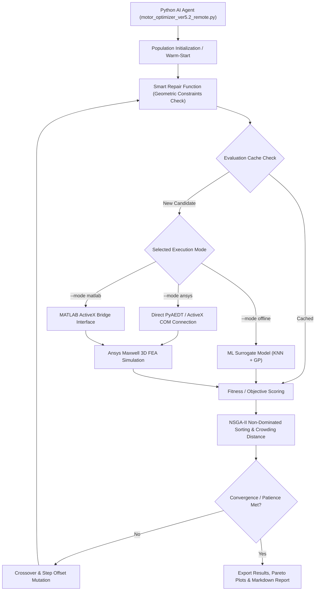

# AI Optimization of V-Shape IPM Motor

[](https://www.python.org/)
[](https://www.ansys.com/)
[]()
[]()

Automated multi-objective design optimization framework for **V-Shape Interior Permanent Magnet (IPM)** electric motors using Genetic Algorithms (GA / NSGA-II) integrated with **Ansys Maxwell 3D** Finite Element Analysis (FEA) and machine learning surrogate models.

---

## 📋 Table of Contents

- [Overview](#-overview)
- [System Architecture & Workflow](#-system-architecture--workflow)
- [Project Structure](#-project-structure)
- [Design Variables & Geometric Constraints](#-design-variables--geometric-constraints)
- [Environment Setup & Installation](#-environment-setup--installation)
- [Input Files Requirements](#-input-files-requirements)
- [Pre-Execution: Clearing Lock Files](#-pre-execution-clearing-lock-files)
- [Execution Commands & CLI Options](#-execution-commands--cli-options)
- [Output Files & Diagnostic Artifacts](#-output-files--diagnostic-artifacts)
- [MATLAB ActiveX Bridge Reference](#-matlab-activex-bridge-reference)

---

## ⚡ Overview

Designing high-performance IPM motors requires balancing complex multi-objective trade-offs such as **motor efficiency**, **torque ripple**, **power density**, and **material cost**.

This repository contains an end-to-end Python AI Optimization Agent (`motor_optimizer_ver5.2_remote.py`) capable of:
- Exploring a **19-dimensional design space** governed by strict geometric feasibility rules.
- Driving **Ansys Maxwell 3D** FEA simulations directly (via PyAEDT / ActiveX) or via a **MATLAB Bridge**.
- Accelerating candidate evaluation using **Hybrid Machine Learning Surrogates** (KNN + Gaussian Process).
- Generating Pareto-optimal design frontiers and detailed diagnostic reports.

---

## 🏗 System Architecture & Workflow



---

## 📁 Project Structure

```
Ai_Optimization_Of_Vshape_IPM_motor/
│
├── motor_optimizer_ver5.2_remote.py        # Main Production Script (v5.2 - Direct Ansys, Caching, Warm-start, NSGA-II)
├── motor_optimizer_ver5.2(fix lan1)_remote.py # Patch iteration script for v5.2
├── motor_optimizer_ver5.1_remote.py        # Previous stable optimization script (v5.1)
├── motor_optimizer_ver5.1.py              # Legacy version 5.1
├── motor_optimizer_ver2.py                # Legacy version 2.0
├── motor_optimizer.py                     # Baseline GA optimization script
├── requirements.txt                       # Python dependencies (pyaedt, pywin32, pandas, numpy, scikit-learn, etc.)
│
├── Ai_Optimization_Bounds.xlsx            # Excel file defining 19 design variable limits, steps & units
├── Ai_Optimization_ParamValues.xlsx       # Excel parameter interchange file for MATLAB bridge
├── Matlab_Ai_Optimization.aedt            # Baseline Ansys Maxwell 3D motor model template
├── Ai_optimization.m                      # MATLAB ActiveX automation script for batch Maxwell simulations
│
├── best_optimized_design_v5.2.csv         # Top-performing design candidate parameters & performance metrics
├── output_vars_iter_*.csv                 # Raw FEA exported transient data for iteration candidate *
├── simulation_history.csv                 # Complete historical database of all evaluated candidate designs
├── log_history.log / optimizer.log        # Detailed system execution & evaluation logs
├── optimizer_state.pkl                    # Checkpoint file for resuming interrupted runs (--resume)
├── optimization_report.md                 # Auto-generated Markdown summary report
│
├── pareto_front.png                       # 2D Pareto front plot (Efficiency vs. Torque Ripple)
├── pareto_3d.png                          # 3D Pareto front plot (Efficiency vs. Torque Ripple vs. Cost)
├── parallel_coordinates.png               # Parallel coordinates visualization across 4 target metrics
├── convergence_history.png                # Fitness score convergence chart across generations
├── sensitivity_analysis.csv               # Spearman rank correlation sensitivity table
│
├── AGENTS.md                              # Instructions & technical guidelines for AI Agents
├── Technical_Reference.md                  # Deep technical reference documentation
├── workflow_optimization.md                # System workflow & Mermaid diagrams
├── variable_evolution_analysis.md         # Variable evolution & parameter trend analysis
├── Optimization Requirements.pdf          # Baseline project requirement specification
└── README.md                              # Main GitHub documentation (this file)
```

---

## 📐 Design Variables & Geometric Constraints

The optimization engine tunes **19 key geometric and electrical parameters**:

| # | Parameter | Description | Initial | Min | Max | Step | Unit |
|---|---|---|---|---|---|---|---|
| 1 | `Dr_in` | Rotor inner diameter | 90.0 | 50.0 | 90.0 | 5.0 | mm |
| 2 | `Air_gap` | Air gap thickness between rotor & stator | 1.0 | 0.5 | 1.5 | 0.1 | mm |
| 3 | `Lamda` | Stack length / Air gap diameter ratio | 0.9 | 0.8 | 1.0 | 0.1 | - |
| 4 | `Bridge` | Distance from outer rotor to magnet slot | 1.5 | 1.0 | 3.0 | 0.1 | mm |
| 5 | `Hs0` | Stator tooth opening height | 1.19 | 1.0 | 2.0 | 0.1 | mm |
| 6 | `Hs1` | Stator tooth wedge height | 1.5 | 1.0 | 2.0 | 0.1 | mm |
| 7 | `Hs2` | Stator main slot height | 18.08 | 16.0 | *Constraint* | 1.0 | mm |
| 8 | `Bs0` | Stator slot opening width | 2.11 | 1.5 | 4.0 | 0.5 | mm |
| 9 | `Bs1` | Stator slot bottom width | 6.90 | 3.0 | 10.0 | 0.5 | mm |
| 10 | `Bs2` | Stator slot top width | 10.88 | 5.0 | 14.0 | 1.0 | mm |
| 11 | `O1` | Duct bottom offset | 5.4 | 0.0 | 13.0 | 1.0 | mm |
| 12 | `O2` | Duct inner rotor offset | 6.0 | 2.0 | 7.0 | 0.5 | mm |
| 13 | `B1` | Duct wall thickness | 3.5 | 3.2 | *Constraint* | 0.5 | mm |
| 14 | `rib` | Rotor bridge rib width | 2.0 | 2.0 | 15.0 | 1.0 | mm |
| 15 | `hrib` | Rotor bridge rib height | 2.4 | 2.0 | 6.0 | 0.5 | mm |
| 16 | `Mt` | Magnet thickness | 5.282 | 4.0 | 6.0 | 0.2 | mm |
| 17 | `Mw` | Magnet width | 25.44 | 10.0 | 30.0 | 2.0 | mm |
| 18 | `magDmin` | Minimum distance between magnet pairs | 10.0 | 0.0 | 10.0 | 1.0 | mm |
| 19 | `thet_deg` | Excitation current advance angle | 30.0 | 0.0 | 90.0 | 1.0 | deg |

---

## 💻 Environment Setup & Installation

> [!IMPORTANT]
> **Pre-Execution Reminder: Always Clear Lingering Lock & Temporary Files!**  
> Before launching a new optimization run, always delete lingering `.lock` files and temporary project files to prevent file access conflicts and ensure clean execution:  
> **PowerShell Command**: `Remove-Item -Path "*.lock", "temp_design_ind_*.aedt*", "output_vars_iter_*.csv" -Recurse -Force -ErrorAction SilentlyContinue`  
> **CMD Command**: `del /f /q *.lock temp_design_ind_*.aedt* output_vars_iter_*.csv`


### 1. Create Virtual Environment

Open Terminal, PowerShell, or Command Prompt in the repository directory and run:

```bash
python -m venv .venv
```


### 2. Activate Virtual Environment

- **Windows PowerShell**:
  ```powershell
  .\.venv\Scripts\Activate.ps1
  ```
- **Windows Command Prompt (CMD)**:
  ```cmd
  .\.venv\Scripts\activate.bat
  ```

*(Verify that `(.venv)` appears at the start of your command prompt)*.

### 3. Install Required Dependencies

```bash
pip install -r requirements.txt
```

---

## 📂 Input Files Requirements

Ensure the following input files are located in the project root directory:

1. **`Ai_Optimization_Bounds.xlsx`**: Excel spreadsheet defining the 19 design variable parameters, lower/upper boundaries, discrete steps, and physical units.
2. **`Matlab_Ai_Optimization.aedt`**: Baseline Ansys Maxwell 3D motor design template project.
3. *(Optional)* **`best_optimized_design_v5.2.csv`**: Seed file containing previous optimal design parameters when using the `--warm-start` option.

---

## 🧹 Pre-Execution: Clearing Lock & Temporary Files

If Ansys Maxwell or a previous optimization run was interrupted abruptly, lingering AEDT lock files (e.g. `Matlab_Ai_Optimization.aedt.lock`) and temporary candidate project files (`temp_design_ind_*.aedt*`) may remain in the workspace, blocking file access or consuming disk space.

**Always clear lock files and temporary simulation files before launching a new optimization run:**

- **Windows PowerShell**:
  ```powershell
  Remove-Item -Path "*.lock" -Force -ErrorAction SilentlyContinue
  Remove-Item -Path "temp_design_ind_*.aedt*" -Recurse -Force -ErrorAction SilentlyContinue
  Remove-Item -Path "output_vars_iter_*.csv" -Force -ErrorAction SilentlyContinue
  ```

- **Command Prompt (CMD)**:
  ```cmd
  del /f /q *.lock
  del /f /q temp_design_ind_*.aedt*
  del /f /q output_vars_iter_*.csv
  ```


---

## 🚀 Execution Commands & CLI Options

### Basic Command Syntax

```bash
python motor_optimizer_ver5.2_remote.py [options]
```

### Simulation Modes (`--mode`)

- **`ansys`** *(Recommended)*: Direct connection to Ansys Maxwell via PyAEDT / ActiveX COM (fastest & most stable FEA connection).
- **`matlab`**: Simulation executed via the MATLAB ActiveX bridge.
- **`offline`**: Ultra-fast surrogate evaluation using machine learning models (KNN + Gaussian Process) without launching Ansys.

---

### Execution Examples

#### 1. Run via MATLAB Bridge with NSGA-II (as requested)
```powershell
python motor_optimizer_ver5.2_remote.py --mode matlab --algorithm nsga2 --pop-size 10 --generations 8
```

#### 2. Direct Ansys Simulation with NSGA-II & Full Plot Generation (Production)
```powershell
python motor_optimizer_ver5.2_remote.py --mode ansys --algorithm nsga2 --pop-size 8 --generations 10 --plot-all
```

#### 3. Offline Fast Surrogate Simulation (Algorithm Verification in seconds)
```powershell
python motor_optimizer_ver5.2_remote.py --mode offline --algorithm nsga2 --pop-size 12 --generations 30 --plot-all
```

#### 4. Run Integration Unit Tests (14 Automated Tests)
```powershell
python motor_optimizer_ver5.2_remote.py --test
```

#### 5. Resume Interrupted Run from Saved Checkpoint (`optimizer_state.pkl`)
```powershell
python motor_optimizer_ver5.2_remote.py --resume --mode ansys --generations 20
```

---

### Command-Line Interface (CLI) Reference Table

| Flag | Default | Description |
|---|---|---|
| `--mode` | `offline` | Simulation execution mode: `ansys` (Direct PyAEDT/COM, no MATLAB), `matlab` (MATLAB bridge), or `offline` (Surrogate ML). |
| `--algorithm` | `ga` | Optimization algorithm choice: `ga` (Genetic Algorithm) or `nsga2` (Multi-Objective NSGA-II). |
| `--pop-size` | `8` | Population size per generation (number of motor candidate designs per generation). |
| `--generations` | `10` | Maximum number of generations to run. |
| `--crossover` | `0.7` | Uniform crossover probability between parent pairs (70%). |
| `--mutation` | `0.2` | Step offset mutation rate per design variable gene (20%). |
| `--seed` | `None` | Seed value for random number generator to ensure experimental reproducibility. |
| `--resume` | `False` | Resumes optimization execution from checkpoint file `optimizer_state.pkl`. |
| `--warm-start` | `None` | Path to CSV file to seed initial population (e.g. `--warm-start best_optimized_design_v5.2.csv`). |
| `--non-graphical` | `True` | Runs Ansys Maxwell in background headless mode (saves 60-70% RAM/CPU resources). |
| `--show-gui` | `False` | Forces Ansys Maxwell 3D GUI to display visibly (disables background headless mode). |
| `--ansys-version` | `2023.2` | Ansys Electronics Desktop version for PyAEDT (e.g. `2023.2`, `2025.2`). |
| `--matlab-exe` | `matlab` | Path to `matlab.exe` executable when using `--mode matlab`. |
| `--max-workers` | `1` | Number of parallel simulation worker threads. |
| `--w-eff` | `1.0` | Objective weight factor for motor efficiency maximization (%). |
| `--w-ripple` | `1.0` | Objective weight penalty factor for torque ripple minimization (%). |
| `--w-pwr` | `0.5` | Objective weight bonus factor for power density (kW/kg). |
| `--w-cost` | `0.05` | Objective weight penalty factor for material cost ($). |
| `--patience` | `20` | Early stopping threshold (maximum consecutive generations without score improvement). |
| `--min-delta` | `0.01` | Minimum score improvement required to reset early stopping counter. |
| `--plot-all` | `False` | Automatically generates all 4 diagnostic & Pareto charts (2D, 3D, Parallel Coordinates, Convergence). |
| `--plot-pareto` | `False` | Generates 2D Pareto optimal front plot (Efficiency vs. Torque Ripple). |
| `--sensitivity` | `False` | Performs Spearman rank correlation sensitivity analysis across 19 design variables. |
| `--no-ml` | `False` | Disables machine learning surrogate model caching. |
| `--no-report` | `False` | Skips auto-generation of Markdown summary report `optimization_report.md`. |
| `--keep-temp` | `False` | Retains raw temporary simulation files (`output_vars_iter_*.csv`, `.aedt`) after completion. |
| `--test` | `False` | Runs 14 automated built-in integration unit tests and exits. |


---

## 📊 Output Files & Diagnostic Artifacts

Upon completion, the framework outputs the following files in the project root:

### 1. Primary Data & Reports
- **`best_optimized_design_v5.2.csv`**: Parameters and performance metrics of the single best design candidate.
- **`output_vars_iter_<N>.csv`**: Raw exported transient FEA variables (currents, flux, back-EMF, torque over time) for candidate `N`.
- **`simulation_history.csv`**: Historical database of all evaluated candidate designs across all generations.
- **`log_history.csv`**: Evaluation status log per individual (runtime, geometric constraint validity, fitness score).
- **`optimizer.log`**: Detailed system execution log file.
- **`optimizer_state.pkl`**: Binary checkpoint file allowing execution resumption via `--resume`.
- **`optimization_report.md`**: Comprehensive summary report formatted in Markdown.

### 2. Diagnostic & Pareto Visualizations (when `--plot-all` is enabled)
- **`pareto_front.png`**: 2D Pareto optimal trade-off curve (Efficiency % vs. Torque Ripple %).
- **`pareto_3d.png`**: 3D Pareto optimal surface (Efficiency % vs. Torque Ripple % vs. Material Cost).
- **`parallel_coordinates.png`**: Multi-dimensional parallel coordinates plot across 4 objective metrics.
- **`convergence_history.png`**: Generation-by-generation fitness convergence trajectory chart.

### 3. Sensitivity Analysis (when `--sensitivity` is enabled)
- **`sensitivity_analysis.csv`**: Spearman rank correlation matrix measuring the impact of each parameter on motor objectives.

---

## 🔌 MATLAB ActiveX Bridge Reference

For legacy setups using the MATLAB bridge (`--mode matlab`), the `Ai_optimization.m` script automates Ansys Maxwell batch simulations using ActiveX COM.

### MATLAB Data Interchange Format (`Ai_Optimization_ParamValues.xlsx`)

| Dr_in | Air_gap | Lamda | Bridge | Hs0 | ... | thet_deg |
|---|---|---|---|---|---|---|
| v1.1 | v1.2 | v1.3 | v1.4 | v1.5 | ... | v1.19 | *(Row 1: Iteration 1)* |
| v2.1 | v2.2 | v2.3 | v2.4 | v2.5 | ... | v2.19 | *(Row 2: Iteration 2)* |

Each row defines one design iteration passed from Python to MATLAB, which updates Maxwell parameters, executes time-step transient analysis, and writes output variables to `output_vars_iter_<N>.csv`.

---

## 📝 License

This project is licensed under the MIT License - see the `LICENSE` file for details.
