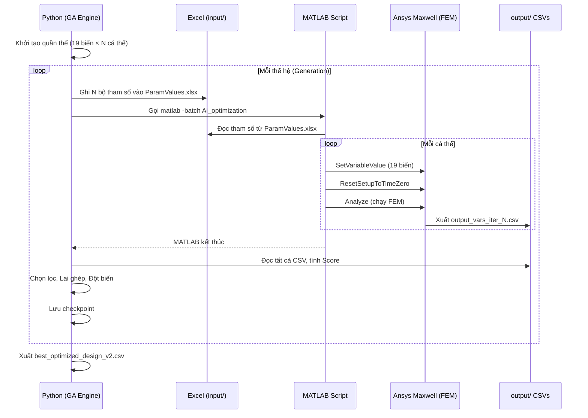

# Tài liệu kỹ thuật chi tiết – Hệ thống tối ưu hóa Motor IPM V-Shape
### Technical Reference Document

> **Mục đích:** Giải thích đầy đủ từ yêu cầu kỹ thuật → các biến → ràng buộc → công thức → cách code Python/MATLAB hoạt động.
> **Dành cho:** Kỹ sư thiết kế muốn hiểu sâu logic vận hành của hệ thống tối ưu hóa.

---

## Mục lục

1. [Bài toán kỹ thuật cần giải quyết](#1-bài-toán-kỹ-thuật-cần-giải-quyết)
2. [Kiến trúc hệ thống](#2-kiến-trúc-hệ-thống)
3. [Tham số hằng số – Giá trị cố định](#3-tham-số-hằng-số--giá-trị-cố-định)
4. [19 Biến thiết kế – Quy tắc và giới hạn](#4-19-biến-thiết-kế--quy-tắc-và-giới-hạn)
5. [Tham số tính toán – Derived Parameters](#5-tham-số-tính-toán--derived-parameters)
6. [Ràng buộc hình học](#6-ràng-buộc-hình-học)
7. [Hàm mục tiêu](#7-hàm-mục-tiêu)
8. [Cơ chế hoạt động của Genetic Algorithm](#8-cơ-chế-hoạt-động-của-genetic-algorithm)
9. [Luồng dữ liệu Python ↔ MATLAB ↔ Ansys](#9-luồng-dữ-liệu-python--matlab--ansys)
10. [Đọc và xử lý kết quả mô phỏng FEM](#10-đọc-và-xử-lý-kết-quả-mô-phỏng-fem)
11. [Hệ thống Checkpoint và Resume](#11-hệ-thống-checkpoint-và-resume)
12. [Chế độ Offline – Surrogate Model](#12-chế-độ-offline--surrogate-model)
13. [Cách chạy thực tế](#13-cách-chạy-thực-tế)
14. [Câu hỏi thường gặp và lỗi phổ biến](#14-câu-hỏi-thường-gặp-và-lỗi-phổ-biến)

---

## 1. Bài toán kỹ thuật cần giải quyết

### Motor IPM V-Shape là gì?

Motor IPM (Interior Permanent Magnet) là loại motor điện mà các nam châm vĩnh cửu được **đặt bên trong rotor** (không phải dán ngoài bề mặt). Thiết kế chữ V nghĩa là các nam châm được đặt theo hình chữ V trong mỗi cực từ.

```
           Stator (vỏ ngoài)
      ┌─────────────────────┐
      │  ┌───────────────┐  │  ← Stator slots (rãnh dây quấn)
      │  │               │  │
      │  │   Air gap     │  │  ← Khe hở không khí (Air_gap)
      │  │  ┌─────────┐  │  │
      │  │  │  ROTOR  │  │  │
      │  │  │  /   \  │  │  │  ← Nam châm hình chữ V (Mt, Mw)
      │  │  │ /     \ │  │  │
      │  │  └─────────┘  │  │
      │  └───────────────┘  │
      └─────────────────────┘
```

### Vấn đề cần tối ưu

Khi thiết kế motor, có hàng chục thông số hình học ảnh hưởng đến hiệu suất. **Không thể thử thủ công** vì:
- Có 19 biến, mỗi biến có nhiều giá trị → không gian tìm kiếm cực lớn.
- Mỗi lần thử cần chạy mô phỏng FEM mất hàng giờ.
- Các thông số ảnh hưởng **phức tạp và phi tuyến** đến nhau.

**Giải pháp:** Dùng **Thuật toán Di truyền (Genetic Algorithm)** để tự động tìm kiếm bộ thông số tốt nhất.

---

## 2. Kiến trúc hệ thống



### Ba thành phần cốt lõi

| Thành phần | File chính | Nhiệm vụ |
|---|---|---|
| **Python AI Agent** | `motor_optimizer_ver5.1_remote.py` | Tạo, đánh giá và chọn lọc các thiết kế (Chạy phẳng ở thư mục gốc) |
| **MATLAB Bridge** | `Ai_optimization.m` | Kết nối Python với Ansys Maxwell |
| **Ansys Maxwell FEM** | `Matlab_Ai_Optimization.aedt` | Chạy mô phỏng điện từ thực tế (Đặt ở thư mục gốc) |

---

## 3. Tham số hằng số – Giá trị cố định

Những tham số này **không thay đổi** trong suốt quá trình tối ưu. Chúng là yêu cầu kỹ thuật cố định của motor.

| Tên biến | Giá trị | Đơn vị | Giải thích |
|---|---|---|---|
| `Ds_out` | 240 | mm | **Đường kính ngoài stator** – Kích thước vỏ máy đã được quyết định |
| `L_stk` | 134 | mm | **Chiều dài stack** – Độ dày của gói lá thép stator |
| `SlotNum` | 36 | – | **Số rãnh stator** – 36 rãnh để quấn dây |
| `PolesNum` | 6 | – | **Số cực từ** – Motor 6 cực (3 cặp cực Bắc–Nam) |
| `Imax` | 200 | A | **Dòng điện đầu vào cực đại** |
| `J` | 5.5 | A/mm² | **Mật độ dòng điện** trong dây dẫn |
| `f0` | 50 | Hz | **Tần số dòng điện** (lưới điện Việt Nam) |
| `Rotor Initial Angle` | -20 | ° | Góc ban đầu của rotor khi bắt đầu mô phỏng |

**Trong code Python:**
```python
DS_OUT = 240.0  # mm – dùng trong kiểm tra ràng buộc
L_STK = 134.0   # mm – dùng tính Ds_in
```

---

## 4. 19 Biến thiết kế – Quy tắc và giới hạn

Đây là **19 biến mà AI được phép thay đổi**. Mỗi biến có:
- **Giá trị khởi điểm ban đầu** (thiết kế gốc của kỹ sư)
- **Giới hạn dưới (Lower)** – không được thấp hơn
- **Giới hạn trên (Upper)** – không được cao hơn  
- **Bước nhảy (Step)** – chỉ được nhận các giá trị `Lower + k × Step`

### Nhóm 1: Thông số Rotor tổng thể

#### `Dr_in` – Đường kính trong Rotor

```
Rotor:  |← Dr_in = 90mm →|
        ╔═══════════════╗
        ║               ║
        ║   (lõi thép)  ║
        ║               ║
        ╚═══════════════╝
```

| | Giá trị |
|---|---|
| Khởi đầu | 90 mm |
| Min | 50 mm |
| Max | 90 mm |
| Bước | 5 mm |
| Giá trị hợp lệ | 50, 55, 60, 65, 70, 75, 80, 85, 90 |

**Ảnh hưởng:** Dr_in lớn → rotor lớn → từ thông nhiều hơn → hiệu suất có xu hướng tăng.

---

#### `Air_gap` – Khe hở không khí

```
Stator inner wall
     ↓
  ───────────  
      ←→  Air_gap (0.5 – 1.5mm)
  ───────────
     ↑
Rotor outer wall (Dr_out)
```

| | Giá trị |
|---|---|
| Khởi đầu | 1.0 mm |
| Min | 0.5 mm |
| Max | 1.5 mm |
| Bước | 0.1 mm |

**Ảnh hưởng:** Air_gap nhỏ → từ trở khe hở nhỏ → hiệu suất tốt hơn, nhưng khó chế tạo và dễ ma sát hơn. Air_gap lớn → torque ripple thường tăng.

---

#### `Lamda` – Tỷ lệ L_stk / D_ag

$$\Lambda = \frac{L_{stk}}{D_{ag}}$$

| | Giá trị |
|---|---|
| Khởi đầu | 0.9 |
| Min | 0.8 |
| Max | 1.0 |
| Bước | 0.1 |
| Giá trị hợp lệ | 0.8, 0.9, 1.0 |

**Ý nghĩa:** Lamda là tỷ lệ hình dạng của motor. Lamda = 1 nghĩa là chiều dài stack bằng đường kính khe hở. Lamda ảnh hưởng **gián tiếp** đến ràng buộc Slot Height (xem Phần 6).

---

#### `Bridge` – Khoảng cách cầu nối từ

```
Rotor outer edge
       ↓
  ─────────────
  ←← Bridge →→  (khoảng cách từ mép ngoài tới lỗ nam châm)
  ┌───────────┐
  │  Magnet   │
  └───────────┘
```

| | Giá trị |
|---|---|
| Khởi đầu | 1.5 mm |
| Min | 1.0 mm |
| Max | 3.0 mm |
| Bước | 0.1 mm |

**Ý nghĩa:** Bridge mỏng → từ thông nam châm thoát qua ít hơn → hiệu suất cao hơn, nhưng cơ học yếu hơn.

---

### Nhóm 2: Thông số Rãnh stator (Slot Geometry)

Rãnh stator là nơi cuộn dây được đặt vào. Hình dạng rãnh ảnh hưởng đến cả diện tích dây quấn và từ thông.

```
     Bs0 (miệng rãnh)
  ┌──┐──────────┌──┐
  │  │          │  │
  │  │          │  │  Hs0 (chiều cao miệng)
  │  └──────────┘  │
  │                │
  │                │  Hs1 (vùng nghiêng)
  │                │
  │                │
  │  ┌──────────┐  │
  │  │  SLOT    │  │  Hs2 (chiều cao rãnh chính)
  │  │  (dây)   │  │
  │  └──────────┘  │
  Bs1          Bs2
```

#### `Hs0` – Chiều cao miệng rãnh

| Min | Max | Bước |
|---|---|---|
| 1.0 mm | 2.0 mm | 0.1 mm |

Hs0 kiểm soát khoảng hở nhỏ ở miệng rãnh, ảnh hưởng đến từ trở và torque ripple.

#### `Hs1` – Chiều cao vùng nghiêng

| Min | Max | Bước |
|---|---|---|
| 1.0 mm | 2.0 mm | 0.1 mm |

Vùng chuyển tiếp giữa miệng rãnh và phần dây quấn chính.

#### `Hs2` – Chiều cao rãnh chính

| Min | Max | Bước |
|---|---|---|
| 16.0 mm | **Xem ràng buộc** | 1.0 mm |

> ⚠️ **Giới hạn trên của Hs2 phụ thuộc vào ràng buộc hình học** – không phải một con số cố định. Xem Phần 6 để biết chi tiết.

#### `Bs0` – Bề rộng miệng rãnh

| Min | Max | Bước |
|---|---|---|
| 1.5 mm | 4.0 mm | 0.5 mm |

#### `Bs1` – Bề rộng rãnh phía dưới

| Min | Max | Bước |
|---|---|---|
| 3.0 mm | 10.0 mm | 0.5 mm |

#### `Bs2` – Bề rộng rãnh phía trên

| Min | Max | Bước |
|---|---|---|
| 5.0 mm | 14.0 mm | 1.0 mm |

---

### Nhóm 3: Thông số ống dẫn từ trong Rotor (Flux Ducts)

```
Rotor cross-section (1 pole pair):
  ┌──────────────────────────────┐
  │                              │
  │   O1 (khoảng cách đáy duct) │
  │   ┌────────────────────┐     │
  │   │   DUCT (B1 dày)    │     │  B1 = bề dày duct
  │   └────────────────────┘     │
  │   O2 (từ inner rotor)        │
  │   ┌────────────────────┐     │
  │   │  MAGNET  (Mt × Mw) │     │
  │   └────────────────────┘     │
  └──────────────────────────────┘
```

#### `O1` – Khoảng cách đáy ống dẫn

| Min | Max | Bước |
|---|---|---|
| 0.0 mm | 13.0 mm | 1.0 mm |

#### `O2` – Khoảng cách ống dẫn từ inner rotor

| Min | Max | Bước |
|---|---|---|
| 2.0 mm | 7.0 mm | 0.5 mm |

#### `B1` – Bề dày ống dẫn (Duct thickness)

| Min | Max | Bước |
|---|---|---|
| 3.2 mm | **`Mt - 0.3`** | 0.5 mm |

> ⚠️ **Giới hạn trên của B1 phụ thuộc vào Mt** – đây là ràng buộc tương quan giữa hai biến. Xem Phần 6.

---

### Nhóm 4: Thông số xương sườn (Rib)

Xương sườn là phần lá thép mỏng giữ cấu trúc rotor, ngăn không cho rotor vỡ khi quay nhanh.

#### `rib` – Bề rộng xương sườn

| Min | Max | Bước |
|---|---|---|
| 2.0 mm | 15.0 mm | 1.0 mm |

#### `hrib` – Chiều cao xương sườn

| Min | Max | Bước |
|---|---|---|
| 2.0 mm | 6.0 mm | 0.5 mm |

---

### Nhóm 5: Thông số nam châm (Magnet)

#### `Mt` – Bề dày nam châm (Magnet thickness)

| Min | Max | Bước |
|---|---|---|
| 4.0 mm | 6.0 mm | 0.2 mm |

Mt lớn → nam châm dày → từ thông nhiều hơn, nhưng chi phí tăng.

#### `Mw` – Bề rộng nam châm (Magnet width)

| Min | Max | Bước |
|---|---|---|
| 10.0 mm | 30.0 mm | 2.0 mm |

#### `magDmin` – Khoảng cách tối thiểu giữa các nam châm

| Min | Max | Bước |
|---|---|---|
| 0.0 mm | 10.0 mm | 1.0 mm |

---

### Nhóm 6: Góc pha dòng điện

#### `thet_deg` – Góc pha kích thích (Current excitation phase)

$$\theta_{rad} = \frac{\theta_{deg} \times \pi}{180}$$

| Min | Max | Bước |
|---|---|---|
| 0° | 90° | 1° |

**Ý nghĩa:** Góc pha giữa dòng điện và trục từ thông của rotor. Điều chỉnh `thet_deg` tương đương với điều chỉnh **field weakening** – cân bằng giữa torque và tốc độ.

---

## 5. Tham số tính toán – Derived Parameters

Những tham số này **được tính từ các biến khác**, không thể điều chỉnh trực tiếp:

| Tên | Công thức | Ý nghĩa |
|---|---|---|
| `D_ag` | $D_{ag} = L_{stk} / \Lambda$ | Đường kính trung bình của khe hở không khí |
| `Ds_in` | $Ds_{in} = D_{ag} + Air\_gap$ | Đường kính trong của stator |
| `Dr_out` | $Dr_{out} = Ds_{in} - 2 \times Air\_gap$ | Đường kính ngoài của rotor |
| `Speed_rpm` | $n = 120 \times f_0 / PolesNum$ | Tốc độ quay = 120×50/6 = **1000 RPM** |
| `D1` | $D_1 = Ds_{in} - 2 \times Air\_gap - 2 \times Bridge$ | Đường kính tối thiểu của duct |
| `A_cond` | $A_{cond} = I_{max} / J$ | Tiết diện một dây dẫn = 200/5.5 ≈ **36.36 mm²** |
| `N` | $N = \lceil 0.7 \times A_{slot} / A_{cond} \rceil$ | Số vòng dây trong một rãnh |
| `t0` | $t_0 = 0$ ms | Thời điểm mô phỏng bắt đầu |

---

## 6. Ràng buộc hình học

### Tại sao cần ràng buộc?

Không phải mọi tổ hợp 19 biến đều có thể tạo ra một motor **vật lý thực tế**. Ví dụ: nếu rãnh stator quá cao, nó sẽ xuyên qua thân stator → motor không thể chế tạo. Ràng buộc ngăn GA tạo ra các thiết kế vô nghĩa.

---

### Ràng buộc 1: Chiều cao rãnh không được vượt quá không gian khả dụng

#### Công thức đầy đủ:

$$Hs_0 + Hs_1 + Hs_2 < \frac{Ds_{out} - Ds_{in}}{2} - 12.25$$

Trong đó:
$$Ds_{in} = \frac{L_{stk}}{Lamda} + Air\_gap$$

#### Giải thích từng bước:

1. **Tính `Ds_in`** (đường kính trong stator):
   - $D_{ag} = L_{stk} / Lamda = 134 / 0.9 \approx 148.9$ mm
   - $Ds_{in} = D_{ag} + Air\_gap = 148.9 + 1.0 = 149.9$ mm

2. **Tính khoảng không gian stator khả dụng** (bán kính):
   - Bán kính stator = $(Ds_{out} - Ds_{in}) / 2 = (240 - 149.9) / 2 = 45.05$ mm
   - Trừ 12.25 mm dành cho phần lõi từ stator: **Không gian cho rãnh = 32.8 mm**

3. **Kiểm tra ràng buộc:**
   - $Hs_0 + Hs_1 + Hs_2 < 32.8$ mm

#### Tại sao trừ 12.25 mm?

Con số 12.25 mm là **chiều dày tối thiểu của lõi từ stator (yoke)** cần thiết để dẫn từ thông mà không bị bão hòa. Đây là một quy tắc thiết kế thực nghiệm (empirical design rule).

#### Code Python kiểm tra ràng buộc này:

```python
def constraint_slot_height(params: dict) -> bool:
    lamda   = params["Lamda"]
    air_gap = params["Air_gap"]
    hs_sum  = params["Hs0"] + params["Hs1"] + params["Hs2"]
    
    ds_in = (L_STK / lamda) + air_gap      # = 134/Lamda + Air_gap
    limit = ((DS_OUT - ds_in) / 2.0) - 12.25  # không gian còn lại
    
    return hs_sum < limit  # True = hợp lệ
```

#### Ví dụ số:

| Kịch bản | Lamda | Air_gap | Ds_in | Không gian | Hs_sum | Hợp lệ? |
|---|---|---|---|---|---|---|
| Baseline | 0.9 | 1.0 | 149.9 | 32.8 mm | 20.8 mm | ✅ |
| Xấu (Hs2=35) | 0.9 | 1.0 | 149.9 | 32.8 mm | 38.0 mm | ❌ |
| Lamda nhỏ | 0.8 | 1.0 | 168.5 | 23.5 mm | 20.8 mm | ✅ (vừa đủ) |

---

### Ràng buộc 2: Bề dày ống dẫn không được lớn hơn bề dày nam châm

#### Công thức:

$$B_1 \le Mt - 0.3 \text{ mm}$$

#### Giải thích:

```
Nam châm (Mt dày):
┌─────────────────────────────────┐
│←──────── Mt (vd: 5.0mm) ──────→│
│                                 │
│  B1 ≤ Mt - 0.3 = 4.7mm        │
│  ┌───────────────────────────┐  │
│  │   DUCT (B1 dày)           │  │
│  └───────────────────────────┘  │
│  0.3mm (khoảng hở tối thiểu)   │
└─────────────────────────────────┘
```

Nếu `B1 > Mt - 0.3`:
- Ống dẫn từ sẽ lớn hơn nam châm
- Nam châm không thể khớp vào vị trí → Motor không thể lắp ráp được

#### Code Python:

```python
def constraint_bridge_thickness(params: dict) -> bool:
    return params["B1"] <= (params["Mt"] - 0.3)
    # True = hợp lệ
```

#### Ví dụ số:

| Mt | B1 | Mt - 0.3 | Hợp lệ? |
|---|---|---|---|
| 5.0 | 3.5 | 4.7 | ✅ 3.5 ≤ 4.7 |
| 5.0 | 4.8 | 4.7 | ❌ 4.8 > 4.7 |
| 4.0 | 3.5 | 3.7 | ✅ 3.5 ≤ 3.7 |
| 4.0 | 4.0 | 3.7 | ❌ 4.0 > 3.7 |

---

### Cơ chế Repair Function (Sửa chữa tự động)

Khi Crossover hoặc Mutation tạo ra cá thể vi phạm ràng buộc, thay vì bỏ đi, hệ thống cố gắng **sửa chữa**:

```python
def repair_individual(ind: dict, bounds: dict) -> dict:
    repaired = ind.copy()
    
    # Bước 1: Snap mọi biến về giá trị hợp lệ gần nhất
    for name, info in bounds.items():
        repaired[name] = snap_to_step(
            repaired[name], 
            info["lower"], 
            info["upper"], 
            info["step"]
        )
    
    # Bước 2: Kiểm tra lại
    if is_feasible(repaired):
        return repaired  # Đã sửa được
    
    return ind  # Sửa không được, trả về gốc
```

**Ví dụ snap_to_step:**

```
B1 = 4.9mm (vi phạm, vì Mt=5.0 → upper = 4.7)
Step = 0.5mm

Các giá trị hợp lệ: 3.2, 3.5, 4.0, 4.5 ← gần nhất là 4.5
→ Snap B1 về 4.5mm → kiểm tra lại ràng buộc → OK ✅
```

---

## 7. Hàm mục tiêu

### Bài toán hai mục tiêu (Multi-Objective)

Motor tốt cần **đồng thời**:
- Hiệu suất (Efficiency) **càng cao càng tốt** → Motor ít hao phí năng lượng
- Nhấp nhô mô-men (Torque Ripple) **càng thấp càng tốt** → Motor êm, không rung

Hai mục tiêu này **thường mâu thuẫn nhau** – thiết kế hiệu suất cao thường gây torque ripple cao và ngược lại.

### Hàm Score (Scalarization)

$$\boxed{\text{Score} = \text{Efficiency}(\%) - \text{Torque Ripple}(\%)}$$

#### Tại sao dùng phép trừ?

Khi trừ Torque Ripple khỏi Efficiency, ta tạo ra một **bề mặt 3D** (contour) trong không gian thiết kế:
- Điểm có Score cao = Eff cao + Ripple thấp → Thiết kế tốt
- Điểm có Score thấp = Eff thấp + Ripple cao → Thiết kế xấu
- GA tìm **đỉnh cao nhất** trên bề mặt đó

#### Ví dụ so sánh:

| Thiết kế | Efficiency | Torque Ripple | Score |
|---|---|---|---|
| A | 95% | 30% | **65** |
| B | 98% | 21% | **77** ← Tốt nhất |
| C | 99% | 35% | **64** |
| D | 92% | 10% | **82** ← Rất tốt (nếu đạt được) |

### Các chỉ số theo dõi thêm (không ảnh hưởng Score)

| Chỉ số | Công thức | Mục tiêu |
|---|---|---|
| **Power Density** | $P_{out} / W_{total}$ | Tối đa – Motor nhỏ gọn |
| **Material Cost** | $\sum V_i \times cost_i$ | Tối thiểu – Tiết kiệm vật liệu |
| **Flux Linkage** | $\varphi = B_{av} \pi D_{sout} L_{stk}$ | Tối đa – Từ thông nhiều |

#### Từ thông liên kết – chi tiết công thức:

**Từ thông tổng qua khe hở:**
$$\varphi_{total} = B_{av} \cdot \pi \cdot D_{sout} \cdot L_{stk}$$

**Từ thông mỗi rãnh stator:**
$$\varphi_{st} = \frac{\varphi_{total}}{SlotNum} = \frac{\varphi_{total}}{36}$$

**Từ thông mỗi cực:**
$$\varphi_{p} = \frac{\varphi_{total}}{PolesNum} = \frac{\varphi_{total}}{6}$$

---

## 8. Cơ chế hoạt động của Genetic Algorithm

GA mô phỏng quá trình tiến hóa tự nhiên. Mỗi "cá thể" là một bộ 19 thông số thiết kế motor.

### 8.1 Khởi tạo quần thể (Initialization)

```python
population = [random_individual(bounds) for _ in range(pop_size)]
```

Mỗi cá thể được tạo ngẫu nhiên:

```python
def random_individual(bounds: dict) -> dict:
    for _ in range(1000):  # Thử tối đa 1000 lần
        individual = {}
        for name, info in bounds.items():
            # Chọn ngẫu nhiên một bước hợp lệ
            steps = int((info["upper"] - info["lower"]) / info["step"])
            k = random.randint(0, steps)
            individual[name] = info["lower"] + k * info["step"]
        
        if is_feasible(individual):  # Kiểm tra ràng buộc
            return individual
    
    return baseline  # Fallback về thiết kế baseline biết chắc hợp lệ
```

---

### 8.2 Đánh giá hiệu suất (Fitness Evaluation)

Với mỗi cá thể → tính Score. Có 2 cách:

**Offline (nhanh, ước lượng):**
```
Score ≈ offline_surrogate(params)
```

**Online (chậm, chính xác):**
```
Python ghi Excel → MATLAB chạy Ansys → Python đọc CSV → tính Score
```

---

### 8.3 Chọn lọc (Tournament Selection)

```python
def tournament(pop, scores):
    i1, i2 = random.sample(range(len(pop)), 2)  # Chọn 2 ngẫu nhiên
    return pop[i1] if scores[i1] > scores[i2] else pop[i2]  # Chọn cái tốt hơn
```

**Tại sao dùng Tournament thay vì Roulette Wheel?**
- Tournament không bị ảnh hưởng bởi scale của Score
- Pressure chọn lọc (selection pressure) dễ điều chỉnh qua kích thước giải đấu
- Ổn định hơn khi Score có giá trị âm

---

### 8.4 Lai ghép (Uniform Crossover)

```python
def crossover(parent1, parent2, bounds, rate=0.7):
    if random.random() > rate:
        return parent1.copy(), parent2.copy()  # Không lai ghép
    
    child1, child2 = {}, {}
    for name in bounds:
        if random.random() < 0.5:
            child1[name] = parent1[name]  # Lấy từ cha
            child2[name] = parent2[name]  # Lấy từ mẹ
        else:
            child1[name] = parent2[name]  # Lấy từ mẹ
            child2[name] = parent1[name]  # Lấy từ cha
    ...
```

**Ví dụ minh họa:**

```
Parent 1: [Dr_in=90, Air_gap=1.0, Lamda=0.9, Bridge=1.5, ...]
Parent 2: [Dr_in=70, Air_gap=0.5, Lamda=0.8, Bridge=2.0, ...]

Xúc xắc:  [   0   ,    1    ,    1   ,    0   , ...]
(0=từ P1, 1=từ P2)

Child 1:   [Dr_in=90, Air_gap=0.5, Lamda=0.8, Bridge=1.5, ...]
Child 2:   [Dr_in=70, Air_gap=1.0, Lamda=0.9, Bridge=2.0, ...]
```

---

### 8.5 Đột biến (Mutation)

```python
def mutate(individual, bounds, rate=0.2):
    mutated = individual.copy()
    for name, info in bounds.items():
        if random.random() < rate:  # 20% xác suất đột biến mỗi gene
            current_step = round((mutated[name] - info["lower"]) / info["step"])
            shift = random.choice([-3, -2, -1, 1, 2, 3])  # Dịch chuyển ±1~3 bước
            new_step = clip(current_step + shift, 0, max_steps)
            mutated[name] = info["lower"] + new_step * info["step"]
    ...
```

**Ví dụ:**
```
Dr_in = 80mm, step = 5mm, range = [50..90]
current_step = (80-50)/5 = 6
shift = +2 → new_step = 8
new Dr_in = 50 + 8×5 = 90mm
```

---

### 8.6 Elitism (Bảo tồn tinh hoa)

```python
next_pop = [best_ind]  # Giữ lại cá thể tốt nhất toàn cục
while len(next_pop) < pop_size:
    # Thêm các cá thể mới từ crossover + mutation
    ...
```

**Tại sao quan trọng?** Không có Elitism, GA có thể "quên" thiết kế tốt nhất đã tìm được sau đột biến mạnh.

---

### 8.7 Vòng lặp tiến hóa hoàn chỉnh

```
Thế hệ 1:  [A, B, C, D, E, F, G, H]  → Evaluate → Scores
Thế hệ 2:  [Best(A), cross(B,D)+mut, cross(F,H)+mut, ...]
Thế hệ 3:  [Best(cross_result), ...]
...
Thế hệ N:  [Thiết kế tối ưu nhất]
```

---

## 9. Luồng dữ liệu Python ↔ MATLAB ↔ Ansys

### Bước 1: Python ghi tham số vào Excel

```python
def write_param_excel(population, path):
    rows = []
    for ind in population:
        rows.append([ind[name] for name in PARAM_ORDER])  # Đảm bảo thứ tự!
    
    df = pd.DataFrame(rows, columns=PARAM_ORDER)
    df.to_excel(path, index=False)
```

**Kết quả trong Excel:**
```
| Dr_in | Air_gap | Lamda | Bridge | Hs0 | ... | thet_deg |
|-------|---------|-------|--------|-----|-----|----------|
|  90   |   0.5   |  0.9  |   2.1  | 1.3 | ... |   20.0   |  ← Cá thể 1
|  75   |   1.0   |  0.8  |   1.5  | 1.0 | ... |   30.0   |  ← Cá thể 2
|  ...  |   ...   |  ...  |   ...  | ... | ... |   ...    |
```

### Bước 2: Python gọi MATLAB

```python
def run_matlab(root_dir):
    result = subprocess.run(
        ["matlab", "-batch", "Ai_optimization"],  # Chạy không có GUI
        cwd=root_dir,       # Thư mục làm việc = gốc dự án
        capture_output=True # Bắt log
    )
```

### Bước 3: MATLAB đọc Excel và gán tham số vào Ansys

```matlab
% Đọc tên biến và đơn vị từ Bounds file
data = readtable('input/Ai_Optimization_Bounds.xlsx');
names = data.Parameter;  % ['Dr_in', 'Air_gap', ...]
units = data.Unit;       % ['mm', 'mm', '', ...]

% Đọc các bộ tham số từ ParamValues file
paramValues = readtable('input/Ai_Optimization_ParamValues.xlsx');

% Với mỗi cá thể (mỗi hàng trong Excel):
for iteration = 1:size(paramValues, 1)
    % Gán từng biến vào Ansys Maxwell
    for i = 1:length(names)
        if units{i} ~= ""
            % Gán với đơn vị: "90mm", "1.0mm", etc.
            SetVariableValue(names{i}, paramValues{iteration,i} + units{i})
        else
            % Gán không có đơn vị: "0.9", "30", etc.
            SetVariableValue(names{i}, num2str(paramValues{iteration,i}))
        end
    end
    
    ResetSetupToTimeZero('Setup1')  % Reset thời gian về 0
    Analyze('Setup1')               % Chạy mô phỏng FEM
    ExportToFile('output/output_vars_iter_N.csv')  % Xuất kết quả
end
```

**Tại sao thứ tự biến PHẢI khớp?**

```
Bounds.xlsx (row order):  Dr_in, Air_gap, Lamda, ...
ParamValues.xlsx (col):   Dr_in, Air_gap, Lamda, ...

MATLAB dùng: names{1} = "Dr_in" → paramValues{iter, 1} = 90.0
             names{2} = "Air_gap" → paramValues{iter, 2} = 0.5

Nếu sai thứ tự: MATLAB gán Air_gap=90mm → Motor bị hỏng cấu hình!
```

---

## 10. Đọc và xử lý kết quả mô phỏng FEM

### Cấu trúc file CSV đầu ra

Mỗi file `output/output_vars_iter_N.csv` chứa dữ liệu theo thời gian:

```
Time[ms], TorqueRip[%], Eff[%], Pin[kW], Pout[kW], TotCost[$], PwrDens[kW/kg], TotWt[kg], Torque[N.m], FluxA[Wb], ...
   0.0,       349.68,     0.0,    2.865,     0.0,     130.45,        0.0,       34.354,    53.91,   -0.128, ...
   0.1,       316.70,     0.0,    3.316,     0.0,     130.45,        0.0,       34.354,    59.53,   -0.114, ...
   ...
  10.0,        21.60,    98.2,   37.800,   37.12,     141.00,       0.350,      34.354,   354.5,   -0.218, ...
  10.1,        21.55,    98.3,   37.820,   37.15,     141.00,       0.351,      34.354,   355.1,   -0.217, ...
```

### Tại sao chỉ lấy nửa sau?

```
Phase đầu (transient): Motor đang "warmup" → dữ liệu chưa ổn định
Phase sau (steady-state): Motor đã đạt trạng thái cân bằng → dữ liệu đáng tin cậy

Timeline:
0ms ──────────────── 5ms ──────────────── 10ms
│← Transient (bỏ) →│← Steady-state (dùng) →│
```

### Code xử lý CSV:

```python
df = pd.read_csv(csv_path)

# Chỉ lấy nửa sau
start = len(df) // 2
steady_state = df.iloc[start:]

# Tìm cột linh hoạt (tên cột có thể khác nhau tùy version Ansys)
eff_col = next((c for c in df.columns if "Eff" in c), None)
tr_col  = next((c for c in df.columns if "TorqueRip" in c), None)

# Tính trung bình trạng thái ổn định
avg_eff = steady_state[eff_col].mean()
avg_tr  = steady_state[tr_col].mean()

score = avg_eff - avg_tr
```

---

## 11. Hệ thống Checkpoint và Resume

### Vấn đề: Mô phỏng FEM mất nhiều giờ

Nếu máy tính crash sau thế hệ 50/100, toàn bộ công sức bị mất. **Checkpoint** lưu trạng thái sau mỗi thế hệ.

### Dữ liệu được lưu

```python
state = {
    "generation": gen,        # Đang ở thế hệ nào
    "population": population, # Toàn bộ quần thể hiện tại (danh sách dict)
    "best_individual": best,  # Bộ tham số tốt nhất đã tìm được
    "best_score": best_score  # Score của bộ tốt nhất
}

with open("output/optimizer_state.pkl", "wb") as f:
    pickle.dump(state, f)
```

### Resume khi bị gián đoạn

```powershell
# Chạy lại, script tự động đọc checkpoint và tiếp tục
python Python_code/motor_optimizer_ver2.py --resume --mode offline --generations 50
```

```python
if args.resume and state_path.is_file():
    state = load_state(state_path)
    population = state["population"]   # Tiếp tục từ quần thể cũ
    best_ind   = state["best_individual"]
    best_score = state["best_score"]
    start_gen  = state["generation"] + 1  # Thế hệ tiếp theo
    # → Không cần chạy lại từ đầu!
```

---

## 12. Chế độ Offline – Surrogate Model

### Khi nào dùng?

- Chưa có Ansys Maxwell / MATLAB
- Muốn kiểm tra logic code
- Muốn chạy nhanh để phân tích tham số

### Công thức surrogate hiện tại

Dựa trên kiến thức vật lý cơ bản (simplified physics):

```python
def offline_surrogate(ind: dict) -> dict:
    # Chuẩn hóa 3 biến quan trọng nhất về [0, 1]
    dr_norm = (ind["Dr_in"] - 50) / (90 - 50)    # Dr_in ảnh hưởng nhiều nhất
    ag_norm = (ind["Air_gap"] - 0.5) / (1.5 - 0.5)  # Air_gap ảnh hưởng thứ hai
    mt_norm = (ind["Mt"] - 4) / (6 - 4)           # Mt (magnet thickness)
    
    # Eff tăng khi: Dr_in tăng, Air_gap giảm, Mt giảm
    eff = 94.0 + 5.0 * dr_norm - 3.0 * ag_norm - 1.0 * mt_norm
    
    # Torque Ripple giảm khi: Dr_in tăng, Air_gap giảm
    torque_ripple = 30.0 - 10.0 * dr_norm + 12.0 * ag_norm + 2.0 * mt_norm
    
    # Chi phí tăng khi: Mt dày, Mw rộng
    cost = 120.0 + 15.0 * mt_norm + 0.5 * ind["Mw"]
    
    return {
        "score": eff - torque_ripple,
        "efficiency": eff,
        "torque_ripple": torque_ripple,
        "cost": cost,
        "power_density": 0.30 + 0.05 * dr_norm - 0.02 * ag_norm
    }
```

> ⚠️ **Lưu ý:** Surrogate này là xấp xỉ tuyến tính đơn giản. Kết quả **KHÔNG chính xác** như FEM. Chỉ dùng để kiểm tra logic và phát triển code.

---

## 13. Cách chạy thực tế

### Thiết lập môi trường lần đầu

```powershell
# 1. Tạo môi trường ảo
python -m venv .venv

# 2. Kích hoạt (giải quyết vấn đề policy Windows)
Set-ExecutionPolicy -Scope Process -ExecutionPolicy Bypass
.\.venv\Scripts\Activate.ps1

# 3. Cài thư viện
pip install -r Python_code/requirements.txt

# Hoặc gọi trực tiếp pip từ venv (nếu không dùng Activate)
.\.venv\Scripts\pip.exe install -r Python_code/requirements.txt
```

### Chạy offline (kiểm tra, không cần Ansys)

```powershell
# Chạy từ thư mục gốc dự án
.\.venv\Scripts\python.exe Python_code/motor_optimizer_ver2.py `
    --pop-size 8 `
    --generations 20 `
    --mode offline

# Kết quả sẽ xuất hiện:
# - output/optimizer.log      (log chi tiết)
# - output/optimizer_state.pkl (checkpoint)
# - output/best_optimized_design_v2.csv (bộ tham số tốt nhất)
```

### Chạy với MATLAB + Ansys (mô phỏng thực)

```powershell
.\.venv\Scripts\python.exe Python_code/motor_optimizer_ver2.py `
    --pop-size 10 `
    --generations 50 `
    --mode matlab
```

### Resume (tiếp tục từ lần bị gián đoạn)

```powershell
# Bổ sung thêm 30 thế hệ từ lần chạy trước
.\.venv\Scripts\python.exe Python_code/motor_optimizer_ver2.py `
    --resume `
    --mode offline `
    --generations 50  # Con số này là tổng, tính từ Gen 1
```

### Tham khảo nhanh tất cả tham số CLI

| Flag | Mặc định | Ý nghĩa |
|---|---|---|
| `--pop-size N` | 8 | Bao nhiêu cá thể mỗi thế hệ |
| `--generations N` | 10 | Chạy bao nhiêu thế hệ |
| `--crossover F` | 0.7 | Xác suất lai ghép (70%) |
| `--mutation F` | 0.2 | Xác suất đột biến mỗi gene (20%) |
| `--mode` | offline | `offline` hoặc `matlab` |
| `--seed N` | None | Seed ngẫu nhiên (để tái lập kết quả) |
| `--resume` | False | Tiếp tục từ checkpoint |

---

## 14. Câu hỏi thường gặp và lỗi phổ biến

### Q: Tại sao kết quả hai lần chạy khác nhau?

A: GA sử dụng số ngẫu nhiên. Thêm `--seed 42` để cố định kết quả:
```powershell
python ... --seed 42
```

### Q: `UnboundLocalError: cannot access local variable 'best_metrics'`

A: Lỗi này đã được sửa trong `motor_optimizer_ver2.py`. Nguyên nhân: khi Resume, nếu thế hệ mới không tìm được kết quả tốt hơn, biến `best_metrics` chưa được gán. Cách sửa: dùng `gen_best_metrics` (metrics của thế hệ hiện tại) thay cho `best_metrics`.

### Q: `ModuleNotFoundError: No module named 'pandas'`

A: Thư viện chưa được cài vào môi trường ảo. Chạy:
```powershell
.\.venv\Scripts\pip.exe install -r Python_code/requirements.txt
```

### Q: MATLAB không tìm thấy file .aedt

A: File `.aedt` phải nằm trong `input/`. Kiểm tra `Ai_optimization.m` dùng đường dẫn đúng:
```matlab
full_project_file = fullfile(script_dir, "input", project_name+".aedt");
```

### Q: Score không cải thiện sau nhiều thế hệ

A: Dấu hiệu hội tụ sớm (premature convergence). Thử:
- Tăng `--mutation` lên 0.3-0.4
- Tăng `--pop-size` lên 20-30
- Dùng `--seed` khác để bắt đầu từ điểm khác

### Q: Làm sao biết kết quả offline có đáng tin không?

A: Kết quả offline **chỉ là hướng dẫn**. Khi có Ansys Maxwell:
1. Lấy bộ tham số tốt nhất từ `output/best_optimized_design_v2.csv`
2. Copy vào `input/Ai_Optimization_ParamValues.xlsx`
3. Chạy MATLAB + Ansys để xác nhận kết quả thực
