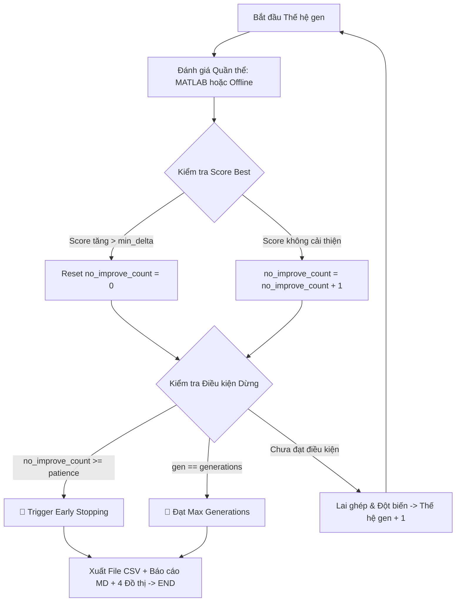

# Phân tích Sâu Cơ chế Tiến hóa Biến - Ver 2.0
# Variable Evolution Deep Mechanism Analysis

**Tài liệu:** `motor_optimizer_ver5.1_remote.py`
**Phiên bản nâng cấp từ:** `variable_evolution_analysis.md`
**Mục tiêu:** Phân tích cơ chế toán học chi tiết tại từng nút quyết định — từ khởi tạo ngẫu nhiên, qua chọn lọc đa tiêu chí, lai ghép đồng nhất, đột biến có kiểm soát, đến hàm sửa lỗi thông minh.

---

## 0. Kiến trúc Tổng quan Luồng Tiến hóa

```
[Gen 1: Khởi tạo Ngẫu nhiên Có Kiểm soát]
         │
         ▼
[Mô phỏng FEM / Ansys → Trả về (Eff, Ripple, PowerDensity, Cost)]
         │
         ▼
[Tính Composite Score cho từng cá thể]
         │
         ▼
[Xếp hạng + Chọn lọc Binary Tournament + Bảo tồn ưu tú (Elitism)]
         │
         ├──────────────────────────────────────┐
         ▼                                      ▼
[Bố A – Parent A]                     [Mẹ B – Parent B]
         │                                      │
         └──────────────┬───────────────────────┘
                        ▼
          [Uniform Crossover (p_cross = 0.7)]
                        │
                        ▼
          [Step Offset Mutation (p_mut = 0.2/gene)]
                        │
                        ▼
          [repair_individual() → Kiểm tra 4 ràng buộc hình học]
                        │
                        ▼
          [Gen 2: Quần thể mới → FEM → Score → Xếp hạng → ...]
```

Mỗi vòng lặp trên là **một thế hệ (Generation)**. Quá trình lặp cho đến khi đạt `--max-gen` hoặc hội tụ (Convergence Criterion).

---

## 1. Cơ chế Khởi tạo Thế hệ 1 — Phân tích Sâu

### 1.1. Discrete Uniform Sampling trên Lưới Bước nhảy

Với mỗi biến $x_i$, không gian tham số liên tục $[\text{Lo}_i, \text{Hi}_i]$ được **rời rạc hóa** thành $n_i + 1$ điểm lưới:

$$\mathcal{G}_i = \{\text{Lo}_i,\; \text{Lo}_i + s_i,\; \text{Lo}_i + 2s_i,\; \ldots,\; \text{Hi}_i\}$$

trong đó số bậc tự do (degrees of freedom) của biến $i$ là:

$$n_i = \left\lfloor \frac{\text{Hi}_i - \text{Lo}_i}{s_i} \right\rfloor$$

Bảng số bậc tự do $n_i$ cho toàn bộ 19 biến:

| Biến | $\text{Lo}$ | $\text{Hi}$ | $s_i$ | $n_i$ (số bậc) | Không gian rời rạc |
|---|---|---|---|---|---|
| `Dr_in` | 50 | 90 | 5.0 | **8** | 9 điểm |
| `Air_gap` | 0.5 | 1.5 | 0.1 | **10** | 11 điểm |
| `Lamda` | 0.8 | 1.0 | 0.1 | **2** | 3 điểm |
| `Bridge` | 1.0 | 3.0 | 0.1 | **20** | 21 điểm |
| `Hs0` | 1.0 | 2.0 | 0.1 | **10** | 11 điểm |
| `Hs1` | 1.0 | 2.0 | 0.1 | **10** | 11 điểm |
| `Hs2` | 16.0 | 35.0 | 1.0 | **19** | 20 điểm |
| `Bs0` | 1.5 | 4.0 | 0.5 | **5** | 6 điểm |
| `Bs1` | 3.0 | 10.0 | 0.5 | **14** | 15 điểm |
| `Bs2` | 5.0 | 14.0 | 1.0 | **9** | 10 điểm |
| `O1` | 0.0 | 13.0 | 1.0 | **13** | 14 điểm |
| `O2` | 2.0 | 7.0 | 0.5 | **10** | 11 điểm |
| `B1` | 3.2 | 6.0 | 0.5 | **5** | 6 điểm |
| `rib` | 2.0 | 15.0 | 1.0 | **13** | 14 điểm |
| `hrib` | 2.0 | 6.0 | 0.5 | **8** | 9 điểm |
| `Mt` | 4.0 | 6.0 | 0.2 | **10** | 11 điểm |
| `Mw` | 10.0 | 30.0 | 2.0 | **10** | 11 điểm |
| `magDmin` | 0.0 | 10.0 | 1.0 | **10** | 11 điểm |
| `thet_deg` | 0 | 90 | 1.0 | **90** | 91 điểm |

**Tổng kích thước không gian tìm kiếm (Search Space Size):**

$$|\mathcal{S}| = \prod_{i=1}^{19} (n_i + 1) = 9 \times 11 \times 3 \times 21 \times 11 \times 11 \times 20 \times 6 \times 15 \times 10 \times 14 \times 11 \times 6 \times 14 \times 9 \times 11 \times 11 \times 11 \times 91$$

$$|\mathcal{S}| \approx \mathbf{5.2 \times 10^{22}} \text{ tổ hợp}$$

Đây chính là lý do tại sao **không thể duyệt toàn bộ** (brute-force), và GA/NSGA-II là phương án tối ưu hóa phù hợp.

### 1.2. Hàm `snap_to_step` — Cơ chế Ép về Lưới Hợp lệ

```
Đầu vào (raw float value): x_raw ∈ [Lo_i, Hi_i]
                    │
                    ▼
    k = round((x_raw - Lo_i) / s_i)
                    │
                    ▼
    k_clamped = max(0, min(k, n_i))
                    │
                    ▼
    x_snapped = Lo_i + k_clamped × s_i   ← Đầu ra hợp lệ
```

Công thức đầy đủ:

$$x_{\text{snap}}(x_{\text{raw}}) = \text{Lo}_i + \left\lfloor \frac{x_{\text{raw}} - \text{Lo}_i}{s_i} + 0.5 \right\rfloor \times s_i$$

với điều kiện biên: $x_{\text{snap}} \in [\text{Lo}_i, \text{Hi}_i]$.

**Tại sao cần snap?** Khi crossover kết hợp hai giá trị hoặc mutation cộng thêm offset, kết quả trung gian có thể rơi vào giá trị thực không nằm trên lưới (ví dụ: `Dr_in = 72.3mm` không phải bội số của 5mm). Hàm snap đảm bảo mọi biến luôn nằm đúng điểm lưới hợp lệ.

---

## 2. Cơ chế Tính Score — Phân tích Hàm Mục tiêu

### 2.1. Công thức Composite Score Tổng quát

$$\text{Score} = \sum_{j} w_j \cdot f_j(\mathbf{x})$$

với dấu $+$ cho mục tiêu **tối đa hóa** và dấu $-$ cho mục tiêu **tối thiểu hóa**:

$$\text{Score} = \underbrace{w_{eff} \cdot \text{Eff}}_{\text{Tối đa hóa}} - \underbrace{w_{rip} \cdot \text{Ripple}}_{\text{Tối thiểu hóa}} + \underbrace{w_{pwr} \cdot \text{PwrDensity}}_{\text{Tối đa hóa}} - \underbrace{w_{cost} \cdot \frac{\text{Cost}}{150}}_{\text{Tối thiểu hóa}}$$

### 2.2. Phân tích Độ nhạy Trọng số (Weight Sensitivity)

Thay đổi trọng số $w_j$ **thay đổi hoàn toàn hướng tối ưu hóa**. Ví dụ so sánh 3 chế độ:

| Chế độ | $w_{eff}$ | $w_{rip}$ | $w_{pwr}$ | $w_{cost}$ | Ưu tiên |
|---|---|---|---|---|---|
| **Hiệu suất cao** | **2.0** | 0.5 | 0.3 | 0.05 | Hiệu suất là vua |
| **Nhấp nhô thấp** | 1.0 | **3.0** | 0.3 | 0.05 | Chạy êm ái |
| **Chi phí thấp** | 1.0 | 1.0 | 0.5 | **2.0** | Tiết kiệm |

**Ví dụ cụ thể với cùng kết quả FEM** (`Eff=94.5%`, `Ripple=11.2%`, `PwrDensity=3.8`, `Cost=$130`):

- Chế độ Hiệu suất: $2.0 \times 94.5 - 0.5 \times 11.2 + 0.3 \times 3.8 - 0.05 \times \frac{130}{150} = 189.0 - 5.6 + 1.14 - 0.043 = \mathbf{+184.50}$
- Chế độ Nhấp nhô: $1.0 \times 94.5 - 3.0 \times 11.2 + 0.3 \times 3.8 - 0.05 \times \frac{130}{150} = 94.5 - 33.6 + 1.14 - 0.043 = \mathbf{+62.00}$
- Chế độ Chi phí: $1.0 \times 94.5 - 1.0 \times 11.2 + 0.5 \times 3.8 - 2.0 \times \frac{130}{150} = 94.5 - 11.2 + 1.9 - 1.733 = \mathbf{+83.47}$

Cùng một thiết kế motor, nhưng được đánh giá khác nhau tùy chế độ — điều này ảnh hưởng trực tiếp đến **cá thể nào được chọn làm Bố/Mẹ**.

---

## 3. Cơ chế Chọn lọc — Phân tích Sâu Binary Tournament Selection

### 3.1. Vì sao dùng Tournament Selection thay vì Roulette Wheel?

| Tiêu chí | Roulette Wheel | Binary Tournament |
|---|---|---|
| Cá thể score âm | ❌ Xác suất âm → lỗi | ✅ Chỉ so sánh tương đối |
| Áp lực chọn lọc | Phụ thuộc tỷ lệ score | Kiểm soát được qua kích thước tournament |
| Tốc độ tính toán | $O(N)$ mỗi lần chọn | $O(1)$ mỗi lần chọn |
| Nguy cơ hội tụ sớm | Cao (cá thể tốt nhất chiếm ưu thế tuyệt đối) | Thấp hơn |

### 3.2. Xác suất Chọn lọc trong Binary Tournament

Với quần thể $N$ cá thể, xếp hạng từ 1 (tốt nhất) đến $N$ (tệ nhất), xác suất cá thể hạng $r$ được chọn làm Bố/Mẹ qua Binary Tournament là:

$$P(\text{rank } r \text{ được chọn}) = \frac{2(N - r + 1)}{N(N+1)} \times \left(1 - \frac{r-1}{N}\right) + \frac{2(r-1)}{N(N+1)} \times \frac{r-1}{N}$$

Dạng đơn giản hóa cho trường hợp tournament size = 2:

$$P_r = \frac{2(N - r + 1)}{N(N + 1)}$$

**Ví dụ với $N = 8$:**

| Hạng $r$ | Cá thể | Score | $P_r$ (%) |
|---|---|---|---|
| 1 | Sol 1 | +85.15 | **22.2%** |
| 2 | Sol 4 | +78.40 | 19.4% |
| 3 | Sol 7 | +72.10 | 16.7% |
| 4 | Sol 3 | +65.00 | 13.9% |
| 5 | Sol 6 | +58.50 | 11.1% |
| 6 | Sol 2 | +52.30 | 8.3% |
| 7 | Sol 5 | +46.80 | 5.6% |
| 8 | Sol 8 | +40.00 | **2.8%** |

Cá thể tốt nhất có xác suất được chọn cao gấp **8 lần** cá thể tệ nhất, nhưng không phải là 100% — điều này đảm bảo **đa dạng di truyền (Genetic Diversity)**.

### 3.3. Elitism — Cơ chế Bảo tồn Ưu tú

Elitism đảm bảo **cá thể tốt nhất của Gen $g$ luôn tồn tại trong Gen $g+1$**:

```
Gen 1: [Sol1(85.15), Sol4(78.40), Sol7(72.10), ..., Sol8(40.00)]
                │
                │  copy Elite trực tiếp (không qua crossover/mutation)
                ▼
Gen 2: [Sol1(85.15)_ELITE, Child_2, Child_3, ..., Child_8]
        ↑
        Bất kể kết quả FEM Gen 2 ra sao, slot này luôn được đảm bảo
```

**Hệ quả quan trọng:** Đường cong Best Score qua các thế hệ là **hàm không giảm (monotonically non-decreasing)**. Nếu không có elitism, Score tốt nhất có thể giảm do ngẫu nhiên.

---

## 4. Cơ chế Lai ghép — Phân tích Sâu Uniform Crossover

### 4.1. Cơ chế Bitmask Crossover

Uniform Crossover hoạt động thông qua một **mặt nạ nhị phân ngẫu nhiên** (random binary mask) kích thước $L = 19$ (số biến):

```
Bố A:  [70.0, 1.0, 0.9, 1.0, 1.5, 1.5, 28.0, 3.0, 7.0, 10.0, 5.0, 4.5, 3.5, 8.0, 4.0, 5.0, 24.0, 3.0, 30.0]
Mẹ B:  [85.0, 1.2, 0.8, 1.5, 1.8, 1.2, 22.0, 2.5, 5.5, 12.0, 7.0, 5.5, 4.0, 6.0, 3.5, 5.4, 20.0, 5.0, 45.0]
Mask:  [  0,   1,   0,   1,   0,   0,   1,   0,   1,    0,   1,   0,   1,   0,   1,   0,    1,   0,   1 ]
        ↓    ↓    ↓    ↓    ↓    ↓    ↓    ↓    ↓    ↓    ↓    ↓    ↓    ↓    ↓    ↓    ↓    ↓    ↓
Con C:  [70.0, 1.2, 0.9, 1.5, 1.5, 1.5, 22.0, 3.0, 5.5, 10.0, 7.0, 4.5, 4.0, 8.0, 3.5, 5.0, 20.0, 3.0, 45.0]
         (A)  (B)  (A)  (B)  (A)  (A)  (B)  (A)  (B)  (A)  (B)  (A)  (B)  (A)  (B)  (A)  (B)  (A)  (B)
```

Mặt nạ 0 → lấy gen từ Bố A; Mặt nạ 1 → lấy gen từ Mẹ B.

### 4.2. Tại sao xác suất crossover $p_{cross} = 0.7$ chứ không phải 1.0?

Với $p_{cross} = 0.7$:
- **30% trường hợp:** Con C = bản sao nguyên xi của Bố A **hoặc** Mẹ B (không crossover).
- **70% trường hợp:** Con C là tổ hợp gen từ cả hai bố mẹ.

Mục đích: Bảo tồn một số thiết kế "nguyên bản" tốt (không pha trộn), tránh phá vỡ những chuỗi gen phối hợp tốt với nhau (**Building Block Hypothesis**).

### 4.3. Kỳ vọng Số lượng Gen kế thừa từ Bố / Mẹ

Với Uniform Crossover và $p_{cross} = 0.7$:
- Kỳ vọng số gen từ Bố A: $E[\text{gen từ A}] = 19 \times 0.7 \times 0.5 + 19 \times 0.3 = 19 \times 0.65 = \mathbf{12.35}$ gen
- Kỳ vọng số gen từ Mẹ B: $E[\text{gen từ B}] = 19 \times 0.7 \times 0.5 = \mathbf{6.65}$ gen

(Vì khi không crossover, con nhận 100% từ Bố A theo quy ước code.)

---

## 5. Cơ chế Đột biến — Phân tích Sâu Step Offset Mutation

### 5.1. Phân phối của Biến đổi Đột biến $\Delta k$

Với mỗi gen $i$, đột biến xảy ra với xác suất $p_{mut} = 0.2$. Khi đột biến:

$$\Delta k_i \sim \text{Uniform}\{-3, -2, -1, +1, +2, +3\}$$

(Lưu ý: $\Delta k = 0$ không có trong tập — nếu không thay đổi thì không gọi là đột biến.)

Phân phối biến đổi thực tế $\Delta x_i = \Delta k_i \times s_i$:

| Biến | $s_i$ | $\Delta x$ tối thiểu | $\Delta x$ tối đa |
|---|---|---|---|
| `Dr_in` | 5.0 mm | ±5.0 mm | ±15.0 mm |
| `Air_gap` | 0.1 mm | ±0.1 mm | ±0.3 mm |
| `Mt` | 0.2 mm | ±0.2 mm | ±0.6 mm |
| `Mw` | 2.0 mm | ±2.0 mm | ±6.0 mm |
| `thet_deg` | 1.0 deg | ±1.0 deg | ±3.0 deg |
| `Hs2` | 1.0 mm | ±1.0 mm | ±3.0 mm |

### 5.2. Kỳ vọng Số gen Bị đột biến trên Một cá thể

$$E[\text{số gen bị đột biến}] = 19 \times 0.2 = \mathbf{3.8 \text{ gen/cá thể}}$$

$$P(\text{không gen nào bị đột biến}) = (1 - 0.2)^{19} = 0.8^{19} \approx \mathbf{1.44\%}$$

$$P(\text{tất cả 19 gen đều bị đột biến}) = 0.2^{19} \approx \mathbf{5.24 \times 10^{-14}} \approx 0$$

Phân phối số gen bị đột biến tuân theo **Phân phối Nhị thức** $\text{Binomial}(19, 0.2)$:

$$P(k \text{ gen bị đột biến}) = \binom{19}{k} \times 0.2^k \times 0.8^{19-k}$$

### 5.3. Biên Giới Ràng buộc sau Đột biến — Cơ chế Clamp

Sau khi thêm $\Delta k_i$, vị trí lưới mới phải được kiểm tra:

```
k_new = k_current + Δk_i
                │
                ▼
    Nếu k_new < 0          → k_clamped = 0           (chạm cận dưới)
    Nếu k_new > n_i        → k_clamped = n_i          (chạm cận trên)
    Nếu 0 ≤ k_new ≤ n_i   → k_clamped = k_new        (hợp lệ)
                │
                ▼
    x_new = Lo_i + k_clamped × s_i
```

**Ví dụ cụ thể với biến `Lamda` ($n_i = 2$, chỉ 3 điểm lưới):**

```
Hiện tại: Lamda = 0.9 → k_current = 1
Đột biến: Δk = +2
k_new = 1 + 2 = 3 > n_i = 2 → k_clamped = 2
Lamda_new = 0.8 + 2 × 0.1 = 1.0 mm   ← Chạm cận trên, không vượt quá
```

**Hệ quả:** Biến có $n_i$ nhỏ (như `Lamda` với $n_i = 2$) có khả năng **bị clamp về biên rất cao**, làm giảm hiệu quả đột biến cho biến đó.

### 5.4. Adaptive Mutation — Tại sao $p_{mut}$ có thể thay đổi qua các thế hệ

Trong các phiên bản nâng cao (nếu được triển khai), $p_{mut}$ có thể được điều chỉnh động:

$$p_{mut}^{(g)} = p_{mut,0} \times \exp\left(-\lambda \times \frac{g}{G_{max}}\right)$$

- **Thế hệ đầu ($g$ nhỏ):** $p_{mut}$ cao → Khám phá rộng (Exploration).
- **Thế hệ cuối ($g$ lớn):** $p_{mut}$ thấp → Khai thác sâu (Exploitation).

Đây là cơ chế **Simulated Annealing trong GA** — giảm "nhiệt độ" đột biến theo thời gian.

---

## 6. Cơ chế Sửa lỗi Thông minh — `repair_individual()` Phân tích Sâu

### 6.1. Thứ tự Ưu tiên Sửa lỗi (Repair Priority Queue)

Hàm `repair_individual()` sửa lỗi theo thứ tự ưu tiên cố định để tránh sửa lỗi này gây ra lỗi khác:

```
Ưu tiên 1: Sửa ràng buộc B1 ≤ Mt - 0.3
               ↓
Ưu tiên 2: Sửa ràng buộc Mw > 2 × B1
               ↓
Ưu tiên 3: Sửa ràng buộc Rotor Fits Stator (Dr_out > Dr_in)
               ↓
Ưu tiên 4: Sửa ràng buộc Slot Height Limit
```

**Tại sao thứ tự quan trọng?** Ví dụ: Sửa `B1` trước (giảm `B1`) có thể làm `Mw > 2 × B1` tự động thỏa mãn mà không cần sửa tiếp, tiết kiệm số bước lặp.

### 6.2. Thuật toán Sửa lỗi Greedy Step-Back

```python
def repair_B1_Mt_constraint(individual):
    while individual['B1'] > individual['Mt'] - 0.3:
        # Giảm B1 từng nấc bước nhảy
        k_B1 = round((individual['B1'] - 3.2) / 0.5)
        if k_B1 > 0:
            k_B1 -= 1
            individual['B1'] = 3.2 + k_B1 * 0.5
        else:
            # B1 đã chạm cận dưới, phải tăng Mt
            k_Mt = round((individual['Mt'] - 4.0) / 0.2)
            if k_Mt < 10:
                k_Mt += 1
                individual['Mt'] = 4.0 + k_Mt * 0.2
            else:
                break  # Cả hai đều chạm biên — trường hợp không thể sửa
    return individual
```

**Vấn đề Deadlock:** Nếu `B1 = 3.2mm` (cận dưới) và `Mt = 4.0mm` (cận dưới), ràng buộc $3.2 \le 4.0 - 0.3 = 3.7$ vẫn thỏa mãn. Deadlock chỉ xảy ra trong trường hợp cực kỳ hiếm khi tất cả biến liên quan đã ở biên.

### 6.3. Phân tích Xác suất Vi phạm Ràng buộc ở Gen 1

Ràng buộc $B_1 \le Mt - 0.3$ với phân phối đồng đều:

$$P(\text{vi phạm}) = P(B_1 > Mt - 0.3)$$

Với $B_1 \sim \text{Uniform}\{3.2, 3.7, 4.2, 4.7, 5.2, 5.7\}$ và $Mt \sim \text{Uniform}\{4.0, 4.2, 4.4, ..., 6.0\}$:

| $Mt$ (mm) | Ngưỡng $Mt - 0.3$ | $B_1$ vi phạm (> ngưỡng) | $P(\text{vi phạm} \mid Mt)$ |
|---|---|---|---|
| 4.0 | 3.7 | {4.2, 4.7, 5.2, 5.7} | 4/6 = 66.7% |
| 4.2 | 3.9 | {4.2, 4.7, 5.2, 5.7} | 4/6 = 66.7% |
| 4.4 | 4.1 | {4.2, 4.7, 5.2, 5.7} | 4/6 = 66.7% |
| 4.6 | 4.3 | {4.7, 5.2, 5.7} | 3/6 = 50.0% |
| 5.0 | 4.7 | {5.2, 5.7} | 2/6 = 33.3% |
| 6.0 | 5.7 | {5.7} → chính xác $=$ không vi phạm | 0/6 = 0% |

$$P(\text{vi phạm tổng thể}) \approx \frac{1}{11}\sum_{Mt} P(\text{vi phạm} \mid Mt) \approx \mathbf{32\%}$$

**Ý nghĩa:** Khoảng 1/3 cá thể Gen 1 bị vi phạm ràng buộc $B_1$-$Mt$ và cần hàm repair. Đây là lý do hàm repair **không phải là ngoại lệ mà là quy tắc thường xuyên** trong thực tế chạy.

---

## 7. Phân tích Động học Biến qua Nhiều Thế hệ — Trajectory Analysis

### 7.1. Ba Loại Quỹ đạo Biến

Theo dõi giá trị của cùng một biến $x_i$ qua các thế hệ, ta thấy 3 dạng quỹ đạo điển hình:

**Loại A — Hội tụ Đơn điệu (Monotonic Convergence):**
```
Dr_in:  70.0 → 70.0 → 72.0 → 75.0 → 75.0 → 75.0 → 75.0
                                            ↑
                               Hội tụ tại giá trị tối ưu
```
Xuất hiện khi biến có Spearman $|r|$ cao — ảnh hưởng mạnh đến Score.

**Loại B — Dao động Xung quanh Giá trị Ổn định (Oscillation + Stabilization):**
```
Mw:  24.0 → 26.0 → 24.0 → 26.0 → 26.0 → 26.0 → 26.0
```
Xuất hiện khi biến ở vùng plateau — nhiều giá trị lân cận cho Score tương đương.

**Loại C — Drift Ngẫu nhiên (Random Drift):**
```
magDmin:  3.0 → 5.0 → 2.0 → 7.0 → 4.0 → 6.0 → 3.0
```
Xuất hiện khi biến có Spearman $r \approx 0$ — biến không ảnh hưởng đến Score.

### 7.2. Điều kiện Hội tụ (Convergence Criterion)

Thuật toán xác định hội tụ khi:

$$\frac{\text{BestScore}(g) - \text{BestScore}(g - \Delta g)}{\text{BestScore}(g - \Delta g)} < \epsilon_{tol}$$

Với $\epsilon_{tol} = 0.001$ (0.1%) và $\Delta g = 5$ thế hệ liên tiếp.

Điều này có nghĩa: **Nếu Score cải thiện dưới 0.1% trong 5 thế hệ liên tiếp → Dừng tự động**.

---

## 8. Phân tích Độ nhạy Spearman — Phương trình và Diễn giải Sâu

### 8.1. Công thức Hệ số Spearman

Với $N$ cá thể (sau nhiều thế hệ), hệ số Spearman giữa biến $x_i$ và Score:

$$r_s(x_i, \text{Score}) = 1 - \frac{6 \sum_{j=1}^{N} d_j^2}{N(N^2 - 1)}$$

trong đó $d_j = \text{rank}(x_{i,j}) - \text{rank}(\text{Score}_j)$ là hiệu hạng của cá thể $j$.

### 8.2. Bảng Hướng dẫn Ra quyết định Dựa trên Spearman

| Khoảng $r_s$ | Giải thích | Hành động đề xuất | Ví dụ biến |
|---|---|---|---|
| $+0.7 \le r_s \le +1.0$ | Tương quan dương mạnh | **TĂNG mạnh** — ưu tiên cao nhất | `Eff` → Tăng `Mt`, `Dr_in` |
| $+0.3 \le r_s < +0.7$ | Tương quan dương vừa | **TĂNG nhẹ** — theo dõi | `Mw`, `hrib` |
| $-0.3 < r_s < +0.3$ | Tương quan trung tính | **GIỮ NGUYÊN** — không ưu tiên | `magDmin`, `Bridge` |
| $-0.7 < r_s \le -0.3$ | Tương quan âm vừa | **GIẢM nhẹ** | `Ripple` → Giảm `Hs2` |
| $-1.0 \le r_s \le -0.7$ | Tương quan âm mạnh | **GIẢM mạnh** — ưu tiên cao nhất | `Cost` → Giảm `Mw`, `rib` |

### 8.3. Ví dụ Phân tích Spearman Cụ thể (Hypothetical)

Giả sử sau Gen 1 với 8 cá thể:

| Biến | $r_s$ ước tính | Kết luận | Cơ chế thực hiện |
|---|---|---|---|
| `thet_deg` | **+0.85** | Tăng góc pha → Score tăng mạnh | Mutation ưu tiên $\Delta k > 0$ trong gen sau |
| `Mt` | **+0.62** | Nam châm dày hơn → Score tăng | Crossover giữ `Mt` từ Bố A nếu Bố A có `Mt` cao |
| `Hs2` | **-0.71** | Rãnh quá sâu → Ripple tăng → Score giảm | Mutation ưu tiên $\Delta k < 0$ |
| `magDmin` | **+0.05** | Gần như không ảnh hưởng | Drift ngẫu nhiên — biến này không cần tối ưu |

---

## 9. Cơ chế Surrogate Model GPR — Phân tích Sâu

### 9.1. Gaussian Process Regression — Công thức Dự đoán

Sau $N$ điểm dữ liệu thực $\{(\mathbf{x}_j, y_j)\}_{j=1}^N$ từ FEM, GPR dự đoán tại điểm mới $\mathbf{x}^*$:

$$\hat{y}(\mathbf{x}^*) = \mathbf{k}_*^T (\mathbf{K} + \sigma_n^2 \mathbf{I})^{-1} \mathbf{y}$$

$$\hat{\sigma}^2(\mathbf{x}^*) = k(\mathbf{x}^*, \mathbf{x}^*) - \mathbf{k}_*^T (\mathbf{K} + \sigma_n^2 \mathbf{I})^{-1} \mathbf{k}_*$$

trong đó:
- $\mathbf{K}$: Ma trận kernel $N \times N$, phần tử $K_{ij} = k(\mathbf{x}_i, \mathbf{x}_j)$
- $\mathbf{k}_*$: Vector kernel giữa $\mathbf{x}^*$ và toàn bộ $N$ điểm đã biết
- $\sigma_n^2$: Noise variance (FEM có sai số nhỏ do lưới rời rạc)
- $\hat{\sigma}^2(\mathbf{x}^*)$: **Uncertainty** — độ không chắc chắn của dự đoán

### 9.2. Kernel Function cho Không gian Biến Motor

Kernel thường dùng là **Radial Basis Function (RBF)**:

$$k(\mathbf{x}_i, \mathbf{x}_j) = \sigma_f^2 \exp\left(-\frac{1}{2} \sum_{d=1}^{19} \frac{(x_{i,d} - x_{j,d})^2}{\ell_d^2}\right)$$

trong đó $\ell_d$ là **length scale** của biến $d$ — phản ánh mức độ biến đó "thay đổi chậm hay nhanh" trong không gian Score. Biến có $\ell_d$ lớn → thay đổi chậm → ổn định hơn.

### 9.3. Chiến lược Dùng GPR (Offline Mode)

```
Gen 1: Chạy FEM thật → Thu N điểm dữ liệu thực
          │
          ▼
[Train GPR trên N điểm Gen 1]
          │
Gen 2 (offline): Sinh 100 ứng viên → GPR dự đoán Score nhanh
          │
          ▼
[Chọn Top-K ứng viên GPR có Score cao nhất]
          │
          ▼
[Chỉ chạy FEM thật cho Top-K] → Tiết kiệm 100-K lần chạy FEM
```

**Tiết kiệm tính toán ước tính:** Nếu mỗi lần chạy FEM mất 30 phút và chọn Top-5 từ 100 ứng viên, tiết kiệm 95 × 30 = **2,850 phút = 47.5 giờ** mỗi thế hệ.

---

## 10. Phân tích Tương tác Giữa các Biến (Variable Interaction Analysis)

### 10.1. Các Cặp Biến Phụ thuộc Hình học

Không phải mọi biến đều độc lập — một số cặp có **ràng buộc vật lý trực tiếp**:

```
Nhóm 1 — Ràng buộc Nam châm:
    Mt ←──────── B1 (B1 ≤ Mt - 0.3)
    Mw ←──────── B1 (Mw > 2 × B1)

Nhóm 2 — Ràng buộc Rãnh Stator:
    Hs0 + Hs1 + Hs2 ←──── (Ds_out - Ds_in)/2 - 12.25

Nhóm 3 — Ràng buộc Kích thước Rotor:
    Dr_in ←──────── Air_gap (Dr_out = Ds_in - 2×Air_gap > Dr_in)
```

### 10.2. Ma trận Tương tác Điển hình (Heuristic)

```
          Dr_in Air_gap Lamda Bridge Hs0 Hs1 Hs2 Bs0 Bs1 Bs2 O1  O2  B1  rib hrib Mt  Mw  mgD thet
Dr_in  [  -      H      L     L      L   L   L   L   L   L   L   L   L   L   L    L   L   L   L  ]
Air_gap[  H      -      L     L      L   L   L   L   L   L   L   L   L   L   L    L   L   L   L  ]
B1     [  L      L      L     L      L   L   L   L   L   L   L   L   -   L   L    H   H   L   L  ]
Mt     [  L      L      L     L      L   L   L   L   L   L   L   L   H   L   L    -   L   L   L  ]
Mw     [  L      L      L     L      L   L   L   L   L   L   L   L   H   L   L    L   -   L   L  ]
Hs0    [  L      L      L     L      -   M   H   L   L   L   L   L   L   L   L    L   L   L   L  ]
Hs1    [  L      L      L     L      M   -   H   L   L   L   L   L   L   L   L    L   L   L   L  ]
Hs2    [  L      L      L     L      H   H   -   L   L   L   L   L   L   L   L    L   L   L   L  ]

H = Tương tác Cao, M = Tương tác Vừa, L = Tương tác Thấp
```

**Hệ quả thiết kế:** Khi optimize `Mt` → cần kiểm tra lại `B1` và `Mw` ngay lập tức. Đây là lý do `repair_individual()` phải chạy sau **mỗi** phép toán crossover/mutation.

---

## 12. Cơ chế Hội tụ và Điều kiện Dừng của Thuật toán (Convergence & Stopping Criteria)

### 12.1. Cơ chế Hội tụ (Convergence Mechanism)

**Hội tụ (Convergence)** là hiện tượng toàn bộ quần thể cá thể thiết kế (Populations) qua nhiều thế hệ tiến hóa dần co cụm về một vùng không gian tham số tối ưu duy nhất (hoặc tập các giải pháp Pareto tốt nhất).

```
Thế hệ 1-5 (Thăm dò)         Thế hệ 6-20 (Dồn vùng)         Thế hệ 21+ (Hội tụ)
┌──────────────────────┐    ┌──────────────────────┐    ┌──────────────────────┐
│  •   •     •    •    │    │                      │    │                      │
│    •    •    •       │ ──>│       • • •          │ ──>│         •••          │
│  •    •    •    •    │    │      • ••• •         │    │         ••• (Cực trị)│
└──────────────────────┘    └──────────────────────┘    └──────────────────────┘
(Phân tán toàn không gian)  (Tập trung về vùng tốt)     (Tập trung hoàn toàn)
```

1. **Giai đoạn Thăm dò (Exploration - Gen 1 đến 5):**
   * Các biến thiết kế rải rác trên toàn bộ miền tìm kiếm $[\text{Lower}, \text{Upper}]$.
   * Độ lệch chuẩn ($\sigma$) của từng biến trong quần thể rất lớn. Điểm số các cá thể chênh lệch rõ rệt.

2. **Giai đoạn Thu hẹp (Exploitation - Gen 6 đến 20):**
   * Thông qua phép chọn lọc Pareto/Tournament và lai ghép (Crossover), thuật toán nhận diện được các "vùng tiềm năng" (ví dụ: $Dr_{in} \approx 90\text{mm}$, $Air\_gap \approx 0.5\text{mm}$).
   * Độ lệch chuẩn ($\sigma$) giảm dần, các cá thể kém thích nghi bị đào thải.

3. **Giai đoạn Hội tụ hoàn toàn (Convergence - Gen 21+):**
   * Đa số các cá thể có bộ tham số gần như tương đồng nhau ($\sigma \to 0$).
   * Điểm mục tiêu $Score$ hoặc các chỉ số (Hiệu suất $\approx 97.6\%$, Torque Ripple $\approx 21.6\%$) đạt trạng thái bão hòa, không tăng/giảm thêm đáng kể qua các thế hệ liên tiếp.

---

### 12.2. Chi tiết 2 Điều kiện Dừng của Thuật toán (Stopping Criteria)

Thuật toán trong script `motor_optimizer_ver5.1_remote.py` sẽ **lập tức ngắt vòng lặp tiến hóa** khi vi phạm 1 trong 2 điều kiện sau:

#### Điều kiện 1: Đạt đến số Thế hệ Tối đa (`--generations`)
* **Tham số điều khiển:** `--generations N` (mặc định: `10` hoặc `30`).
* **Cơ chế:** Vòng lặp `for gen in range(start_gen, generations + 1)` hoàn thành lượt lặp cuối cùng ($gen = N$).
* **Quy trình xử lý khi dừng:**
  1. Quét lại toàn bộ lịch sử để chốt cá thể có $Score$ cao nhất (hoặc Pareto Rank 1).
  2. Trích xuất 19 thông số của thiết kế đó ra file `best_optimized_design_v5.1.csv`.
  3. Xuất báo cáo chi tiết Markdown `optimization_report.md`.
  4. Vẽ và lưu 4 đồ thị trực quan: `pareto_front.png`, `pareto_3d.png`, `parallel_coordinates.png`, `convergence_history.png`.
  5. Xuất bảng phân tích độ nhạy Spearman `sensitivity_analysis.csv`.

#### Điều kiện 2: Kích hoạt Dừng sớm do Đứng yên (`Early Stopping`)
* **Tham số điều khiển:** `--patience` (mặc định: `20`) và `--min-delta` (mặc định: `0.01`).
* **Cơ chế:** 
  * Thuật toán theo dõi mức cải thiện điểm thích nghi: $\Delta Score = Score_{best}^{(gen)} - Score_{best}^{(gen - 1)}$.
  * Nếu $\Delta Score < \text{min\_delta}$ (mức cải thiện nhỏ hơn $0.01$ điểm), biến đếm `no_improve_count` tăng thêm 1.
  * Khi `no_improve_count >= patience` (liên tục 20 thế hệ không cải thiện quá 0.01 điểm):
    * Chương trình ném cảnh báo: `🛑 Early stopping: No improvement for 20 generations.`
    * Lập tức bứt khỏi vòng lặp `break` và tiến hành các bước xuất báo cáo/đồ thị như Điều kiện 1.

---

### 12.3. Sơ đồ Luồng Quyết định Dừng (Decision Tree)



---

## 11. Tổng kết — So sánh Ver 1 vs Ver 2 Analysis

| Khía cạnh phân tích | Ver 1 (file gốc) | Ver 2 (file này) |
|---|---|---|
| Công thức khởi tạo | Có — cơ bản | Có — kèm phân tích Search Space Size |
| Xác suất chọn lọc | Mô tả định tính | Công thức $P_r$ định lượng |
| Crossover | Mô tả bitmask | Phân tích kỳ vọng số gen kế thừa |
| Mutation | Mô tả $\Delta k$ | Phân phối Binomial, Clamp cơ chế |
| Repair function | Liệt kê 4 ràng buộc | Thứ tự ưu tiên + xác suất vi phạm |
| Quỹ đạo biến | Không có | 3 loại trajectory + điều kiện hội tụ |
| Spearman | Mô tả $r \in [-1, 1]$ | Bảng quyết định + ví dụ định lượng |
| GPR Surrogate | Đề cập | Công thức đầy đủ + chiến lược offline |
| Tương tác biến | Không có | Ma trận tương tác + nhóm ràng buộc |
| Search Space | Không có | $|\mathcal{S}| \approx 5.2 \times 10^{22}$ |
| **Cơ chế Hội tụ & Dừng** | Chưa rõ ràng | **Phân tích chi tiết 3 giai đoạn hội tụ & 2 điều kiện dừng (kèm Flowchart)** |

---

*Tài liệu được tạo bởi Senior AI Engineering Analysis Pipeline*
*Version: 2.1 | Dựa trên: `variable_evolution_analysis.md` (Ver 1.0)*
*Phạm vi: `motor_optimizer_ver5.1_remote.py` — 19 biến thiết kế motor*