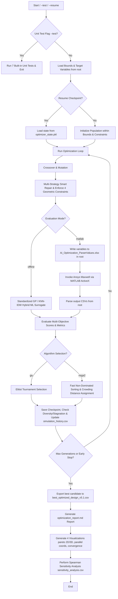

# V-Shape IPM Motor Optimization Workflow (v5.1 Remote)

This document describes the workflow of the Python-based AI Optimization Agent implemented in [motor_optimizer_ver5.1_remote.py](file:///d:/Ai_Optimization_Of_Vshape_IPM_motor/motor_optimizer_ver5.1_remote.py). It acts as a closed-loop system coordinating variables, constraints, genetic operations (Standard GA & NSGA-II), standardized Gaussian Process / KNN-IDW hybrid surrogates, MATLAB simulation interfaces, sensitivity analysis, 4-plot multi-dimensional visualizations, built-in unit tests, and automated Markdown report generation, operating on flat root-level files.

---

## 1. High-Level Architecture

The optimization process operates in an evolutionary loop, using either a physical **ActiveX MATLAB-Ansys simulation** or a **Standardized Gaussian Process / KNN-IDW Hybrid ML Surrogate model** to guide the selection of motor design candidates.

---

## 2. Key Components

### A. Design Boundaries & Canonical Ordering
*   **Variable Schema**: Loaded dynamically from [Ai_Optimization_Bounds.xlsx](file:///d:/Ai_Optimization_Of_Vshape_IPM_motor/Ai_Optimization_Bounds.xlsx).
*   **Ordering Guarantee**: To prevent mismatched coordinates during batch execution, variables are stored in an ordered sequence `PARAM_ORDER` which coordinates Excel writes, MATLAB reads, and ML feature matrices.

### B. Geometrical Constraints & Smart Repair
To keep candidates physically buildable, four strict constraints are enforced:
1.  **Slot Height Limit**: $Hs_0 + Hs_1 + Hs_2 < \frac{Ds_{out} - Ds_{in}}{2} - 12.25$
2.  **Bridge Thickness Limit**: $B_1 \le Mt - 0.3$
3.  **Rotor Fits Stator**: $Dr_{out} > Dr_{in}$ where $Dr_{out} = Ds_{in} - 2 \cdot Air\_gap$
4.  **Magnet Duct Fit**: $Mw > 2 \cdot B_1$

*If an individual violates these during crossover or mutation, a **Multi-Strategy Smart Repair Function** snaps offending variables back to valid step coordinates and intelligently reduces violating dimensions (e.g. Hs, B1, Dr_in). If repair fails, the fallback baseline is used.*

### C. Simulation Back-Ends & Standardized Hybrid ML Surrogate
Controlled by the `--mode` flag:
1.  **`offline` (Default)**: A hybrid surrogate combining a 7-parameter physical model with a **Standardized Gaussian Process Regressor** (`sklearn`) or **KNN Inverse Distance Weighting** trained dynamically on `simulation_history.csv` once $\ge 15$ evaluations are recorded. Input vectors are normalized to $[0, 1]$ to eliminate feature magnitude bias.
2.  **`matlab`**: A full simulator runner that writes variables, invokes Ansys Maxwell via ActiveX (`Ai_optimization.m`), and averages the steady-state outputs of the resulting CSV reports.

---

## 3. Detailed Execution Pipeline

### Step 1: Initial Preparation & Unit Testing
*   If `--test` is specified, run 7 built-in unit tests (validating constraints, dominance sorting, crowding distance, repair mechanisms, and score formula) and exit cleanly.
*   Load parameter bounds from Excel.
*   Setup single-handler UTF-8 logging inside `output/optimizer.log`.
*   If `--resume` is active, restore state from `output/optimizer_state.pkl`.

### Step 2: Evolutionary & Multi-Objective Operations
For each generation:
1.  **Evaluation**: Evaluate via Standardized Hybrid ML/Physics surrogate or MATLAB FEM.
2.  **Selection Engine**:
    *   `--algorithm ga`: Standard Elitist Tournament selection using weighted composite score $Score = w_{eff}\cdot Eff - w_{rip}\cdot Ripple + w_{pwr}\cdot Pwr - w_{cost}\cdot Cost/150$.
    *   `--algorithm nsga2`: Deb's NSGA-II multi-objective selection using Fast Non-Dominated Sorting and Crowding Distance Assignment.
3.  **Crossover**: Uniform crossover mixes parameter configurations.
4.  **Mutation**: Shifts genes by $\pm 1$ to $\pm 3$ steps probabilistically.
5.  **Smart Repair & Diversity Check**: Monitors population diversity and alerts if population diversity collapses or optimization stagnates.

### Step 3: Logging & Early Stopping
*   Appends evaluated candidates to `output/simulation_history.csv`.
*   Triggers **Early Stopping** if best score does not improve by `--min-delta` (0.01) for `--patience` (20) generations.
*   Saves state checkpoint to `output/optimizer_state.pkl`.

### Step 4: Final Output, Automated Reporting & Advanced Plotting
*   Saves absolute best parameters to [best_optimized_design_v5.1.csv](file:///d:/Ai_Optimization_Of_Vshape_IPM_motor/output/best_optimized_design_v5.1.csv).
*   Generates Markdown summary report at [optimization_report.md](file:///d:/Ai_Optimization_Of_Vshape_IPM_motor/output/optimization_report.md).
*   Generates 4 advanced visualizations (`--plot-all`):
    *   `output/pareto_front.png` (2D Efficiency vs Torque Ripple)
    *   `output/pareto_3d.png` (3D Efficiency vs Torque Ripple vs Cost)
    *   `output/parallel_coordinates.png` (Parallel Coordinates for 4 objectives)
    *   `output/convergence_history.png` (Best Score per Generation)
*   Computes Spearman rank correlations for 19 design variables and exports to [sensitivity_analysis.csv](file:///d:/Ai_Optimization_Of_Vshape_IPM_motor/output/sensitivity_analysis.csv).
